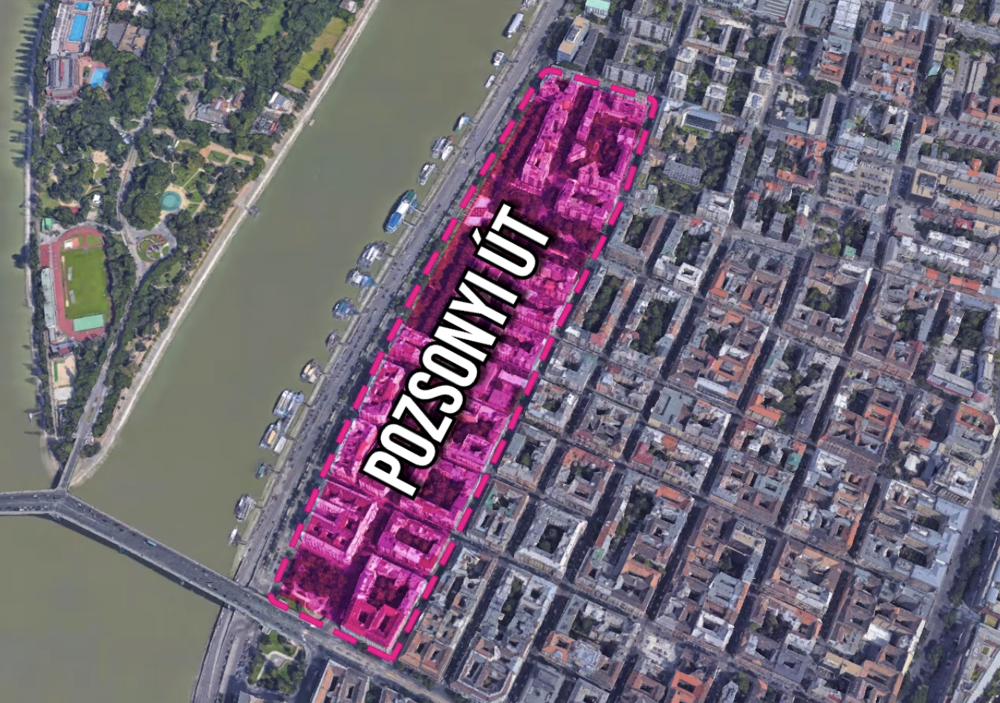

* [TimeOut Market](https://maps.app.goo.gl/jDAGtrRWeiJWqyAi6)
* [POZSONYI_UT](https://maps.app.goo.gl/3P8vrrjfKBcnuW587)  
* [Belvárosi Disznótoros - Károlyi utca](https://maps.app.goo.gl/V5AHqvBuMTrQLZgq7): 匈牙利烤香腸  
    * 红色的烤香腸 Sült Kolbász
    * 特色食品血腸 Hurka
* [Molnár's Kürtőskalács - Váci utca](https://maps.app.goo.gl/4KzxEEuUbUvorTp47): 煙囪麵包捲 Kürtőskalács
    * 麵團纏繞木棍上炭烤，表層裹肉桂糖粉的中空圓筒麵包
    * 約1,000福林（2.5歐元以下），全市各大景點附近街頭均有攤販
* 千層蛋糕 Dobos torta
    * 由甜點師 József C. Dobos 發明，多層海綿蛋糕夾巧克力奶油，頂覆焦糖脆層
    * 扭高地火車站附近 - [Zsolnay Kávéház - Teréz krt. 43](https://maps.app.goo.gl/mnk2XigbuNKzer3PA)
    * 扭高地火車站附近 - [Hamdi Cukrászda - Jókai u. 16](https://maps.app.goo.gl/PCod67RZdexxRiD99)
    * 摩天輪附近 - [Café Gerbeaud - Vörösmarty tér 7-8](https://maps.app.goo.gl/CFYMc4BJTn8hEqLa)
    * 摩天輪附近 - [Szamos Gourmet Ház - Váci u 1](https://maps.app.goo.gl/sR4nMK2oo554EVaE)
    * 伊麗莎白橋（茜茜公主橋）橋頭 - [Auguszt Cukrászda Belváros - Kossuth Lajos u. 14-16](https://maps.app.goo.gl/dncS9s4H9SD6Xi4z6)
    * 聖伊什特萬聖殿附近 - [Stephen Confectionery - Október 6. u. 17](https://maps.app.goo.gl/zjK6KJYgcB1CqzFc7)
    * 議會大樓附近 - [Szamos Cafe - Kossuth Lajos tér 10](https://maps.app.goo.gl/YMpTQ4Z2mRttz6we)
    * 漁夫堡 - [Ruszwurm Cukrászda - Szentháromság u. 7](https://maps.app.goo.gl/6bV1sH9ysxs4eF3AA)
    * 中央市場附近 - [Kemenes Cukrászda és Bisztró - Vámház krt. 9](https://maps.app.goo.gl/PUpv4AsMBEFeGN1aA)
* [Nagycsarnok - Fővám tér](https://maps.app.goo.gl/W44FysmP54Mu4Ns): 起司巧克力棒 Túró Rudi
    * 白乾酪外裹巧克力的棒狀甜點，匈牙利國民零食
    * Spar、ALDI、Lidl 等超市及中央市場大廳均有販售
* 起司烤餅 Cheese Pogácsa
    * 鹹味奶酪圓形小餅，口感酥脆，傳統匈牙利烘焙點心
    * 超市及中央市場大廳均有販售，可作伴手禮
    * 中央市場 - [Nagycsarnok - Fővám tér](https://maps.app.goo.gl/W44FysmP54Mu4Ns)
    * 伊莉莎白橋（茜茜公主橋）橋頭 - [Fornetti - Ferenciek tere 2](https://maps.app.goo.gl/aUUB35S4zmGtrBS4A)
    * 扭高地火車站附近 - [Fornetti - Teréz krt. 55](https://maps.app.goo.gl/eSqVtgysCX5UQKsL6)
    * Keleti火車站 - [Fornetti - Kerepesi út 2-4](https://maps.app.goo.gl/dp7Avosg6EU8t12a8)
* [Nagycsarnok - Fővám tér](https://maps.app.goo.gl/W44FysmP54Mu4Ns): 薩拉米香腸 Pick Szalámi
    * 匈牙利著名薩拉米，以獨特香料醃製熟成，風味濃郁
    * 中央市場大廳一樓有多家香腸攤販，可試吃選購
* [Nagycsarnok - Fővám tér](https://maps.app.goo.gl/W44FysmP54Mu4Ns): 辣椒粉 Paprika
    * 匈牙利料理靈魂香料，分甜味（Édes）與辣味（Csípős）兩種
    * 精美包裝是最受歡迎的伴手禮之一，中央市場大廳選擇最多
* [Nagycsarnok - Fővám tér](https://maps.app.goo.gl/W44FysmP54Mu4Ns): 鵝肝 Libamáj
    * 匈牙利特產，風味細膩，可購買新鮮或罐裝
    * 中央市場大廳一樓可購得，新鮮鵝肝需冷藏保存
* [Nagycsarnok - Fővám tér](https://maps.app.goo.gl/W44FysmP54Mu4Ns): 託卡伊貴腐酒 Tokaji Aszú
    * 匈牙利最著名甜白葡萄酒，產自東北部托卡伊地區
    * 有「酒中之王，王者之酒」美譽，超市及中央市場大廳均有販售
* 匈牙利魚湯 Fisherman's soup, 匈牙利語叫做 Halászlé
* 辣椒雞 Paprikás Csirke
* 水果湯 Gyümölcsleves, 喝起來其實跟優格一樣
* 蘋果派 Almas Pité
* 肉餡捲餅 Hortobágyi palacsinta