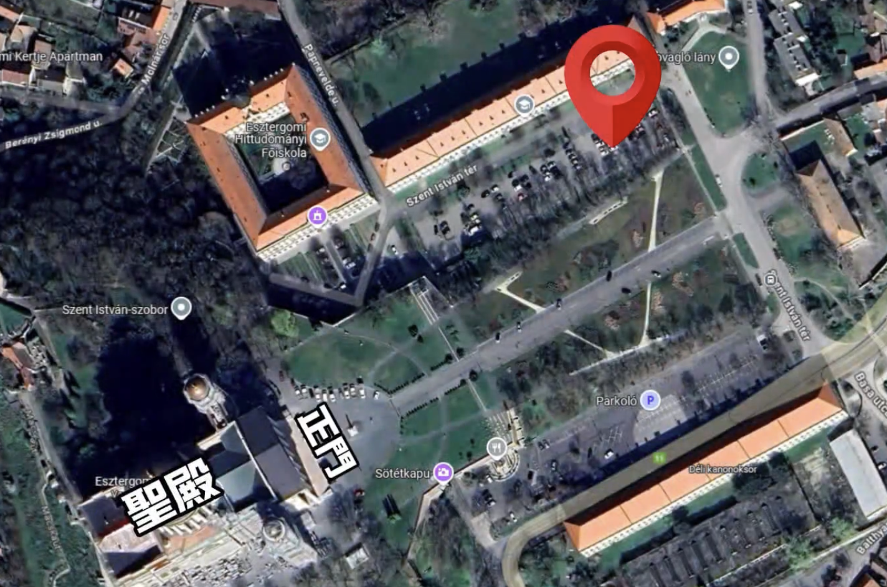
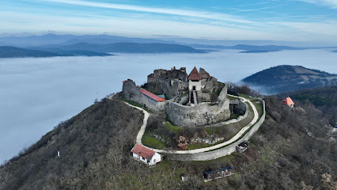
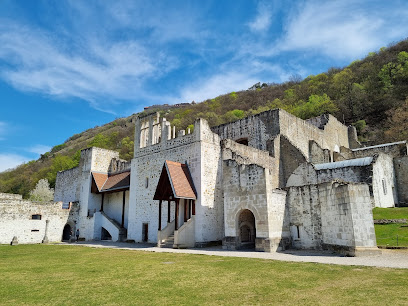
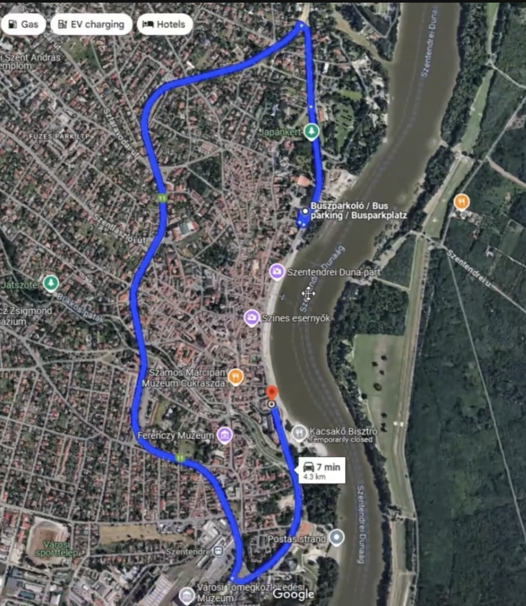
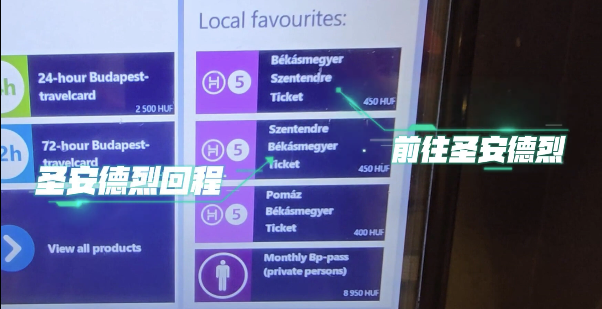

1. Budapest public transport system 的兩種通行票：
   * 15日通票：5950 HUF
   * 72小時通票：5500 HUF 
   **重點**：只多花 450 HUF，就可以從 3天升級到15天。  
   **結論**：15日通票的性價比遠高於72小時通票，圖片是在提醒使用者：選短期票其實不划算。

2. [Gellért Hill & Citadel](https://maps.app.goo.gl/2EySX1cUdVWbDunKA) : 自由女神山（又名：蓋勒特山）
   * Google 地圖搜尋目的地 "[Móricz Zsigmond körtér](https://maps.app.goo.gl/JQTxSe4BnohxyKWV9)"，抵達後轉乘 27 路公車至 "[Búsuló Juhász](https://maps.app.goo.gl/1gyA3oHP9dC1FqYT7)" 站下車，可避免徒步爬山的辛勞
   * 洗手間
        * 綠色鐵皮屋： 位於城堡門口附近，收費 250 福林。
        * 北邊入口洗手間： 位於堡壘北側，雖然影片拍攝時（剛開放期間）是免費的，但機器顯示屏標示收費可能為 100 福林
3. [Night Cruise on the Danube (Budapest, Hungary)](https://www.youtube.com/watch?v=67v9RqmxqJI)
   * [ticket](https://hajoznijo.hu/budapest-boat-cruises/budapest-city-highlights-cruise/), $18 euro
   * [ticket](https://www.viator.com/tours/Budapest/60-minutes-Budapest-Sightseeing-Cruise/d499-411878P1), $16 euro
   * [ticket](https://www.viator.com/tours/Budapest/70-minutes-Night-Time-Danube-Sightseeing-Cruise-with-welcome-drink/d499-15186P42) $15 euro

4. [布達佩斯浴場聯合官網](https://www.spasbudapest.com)
   * [Széchenyi gyógyfürdő](https://maps.app.goo.gl/rmHmTgTsFgPFaWXv9)  
      * $13200 Ft
      * 
   * [Palatinus Thermal and Open-air Bath](https://maps.app.goo.gl/sQospzm5YfTHAj1N8)
      * $3600 Ft
      * 
5. 廢墟酒吧最具代表的是這家 [Szimpla Kert](https://maps.app.goo.gl/A3iDrotz1LeEsasx5)
6. [多瑙河三小鎮](https://youtu.be/Zc-sZZY8tkE?si=Y7cUC-oGvKII8n5O)
   * *埃斯泰爾戈姆 Esztergom: Basilica of Esztergom*, [parking 正門右邊的停車場 - free](https://maps.app.goo.gl/bDuPkqASCiqFaezy8)  
   * *維謝格拉德 Visegrad*: 
     * 維謝格拉德城堡, [parking](https://maps.app.goo.gl/k1Fow6GYDThP7aPBA)
       * [城堡内部洗手間（免費）](https://maps.app.goo.gl/URPvMxTt5S7u6sMv6)
       * 
     
     * 維謝格拉德皇宮, 可以省略，時間趕的話, [parking](https://maps.app.goo.gl/4C9yER628SUvxMs87) 
     

     * 山腳下有一間當地特色餐廳[文藝復興餐廳](https://maps.app.goo.gl/qY8LqY43rdYDK2cQ7), 獨特裝修風格並且還提供一些中世紀人們的服裝，可以讓顧客Cosplay一下中世紀的各種人物
   *  *聖安德烈 Szentendre*
         * 停車: 小鎮的兩頭都有停車場，有時在一旁沒有找到停車位就直接橫越小鎮中心的這條路 直接到了小鎮的另一邊的停車場 但是小鎮裡邊的這條路，是 *不允許* 外來車輛進入的 如果你要到另一邊你只能從小鎮外圍的公路繞一個圈再來到這邊 
           * [停車點1](https://maps.app.goo.gl/XJEY2JD6txbkANCB9)
           * [停車點2](https://maps.app.goo.gl/3rMVFiM3CNa1Rx2R6)
           * [停車點3](https://maps.app.goo.gl/Hgqmb6qmpvhqvDPM7)
           * [停車點4](https://maps.app.goo.gl/PgVCV3hEvG5AGo1s7)
           * [停車點5](https://maps.app.goo.gl/sdVbWNbZwNuHPdJa8)
         * 洗手間
           * [小鎮北邊洗手間](https://maps.app.goo.gl/u8D9uvuCYgnvtGib7)
           * [小鎮南邊洗手間](https://maps.app.goo.gl/PX52kfpsCcsi3taM9)

7. [如何去 Szentendre](https://youtu.be/cvXujyyt4b0?si=Pc8-xI7UhenBMkzw) ：
   * 用市區票可以坐到 Batthyány tér
   * 買延伸票（extension ticket）
   * H5 郊區鐵路前往 Szentendre 
   
   