# Budapest 3-Day Spring Itinerary

A balanced spring tour of Budapest mixing classic icons, foodie stops, and quirky hidden gems — built from the YouTube playlist [匈牙利景點攻略 (Hungary Attractions Guide)](https://youtube.com/playlist?list=PLmQssQKbiWpajLj9tiWiz3kWUFKr4TUUk).

**Why spring?** March–May means mild weather (10–22°C), cherry blossoms on Margaret Island, fewer crowds than summer, and (if you're there March 15) the Hungarian Revolution Day with cockades, parades, and free museum entry. Thermal baths are still glorious — outdoor pools at Széchenyi steam in the cool morning air.

**Practical basics**
- **Currency:** Hungarian Forint (HUF). Cards accepted nearly everywhere; keep ~10,000 HUF cash for markets, public WCs, and tips.
- **Transport:** Buy a **72-hour Budapest travel card** (~5,500 HUF) at any metro vending machine — covers metro lines M1–M4, all trams, buses, the HÉV suburban line, and the boat lines D11/D12 on the Danube. Validate paper tickets before boarding (orange box on trams/buses, gates on metro). Download **BudapestGO** on your phone to plan routes and buy tickets.
- **Tipping:** 10–12% in restaurants — but check the bill: if `service charge` / `szervízdíj` (~12.5%) is already added, no extra needed. 100–200 HUF for café staff is fine.
- **Tap water:** Safe and excellent — refill your bottle. Free public drinking fountains (`ivókút`) marked with a faucet symbol are scattered around Margaret Island, Erzsébet tér, and the Danube promenade.
- **Booking ahead:** Parliament tour, Hospital in the Rock, and New York Café reservations sell out — book 1–2 weeks early.

**Food culture cheat sheet**
- **Mealtimes:** Hungarians eat lunch 12:00–14:00 (the main hot meal of the day) and dinner 19:00–21:00. Most restaurants offer a great-value **napi menü** (daily set menu) for 2,500–4,500 HUF on weekdays.
- **Must-try dishes:** goulash, chicken paprikash, lángos, kürtőskalács, Dobos torte. Full guide in [food.md](food.md).
- **Coffee:** Order `presszó kávé` (espresso) or `tejeskávé` (with milk). Hungarian "long" coffee is short — say `dupla` if you want a double.
- **Water at meals:** Tap water is rarely brought unsolicited; ask for `csapvíz` (free) or you'll get a paid bottle.

**Washrooms (WC) primer**
- Public toilets in Hungary are usually **paid** — keep 200–500 HUF coins ready (the attendant or a turnstile).
- Free toilets are available in: any restaurant or café where you're a customer, every shopping mall (Mammut, Westend, Arena Mall), all metro stations on M1, IKEA Budakeszi, and most museums (with ticket).
- Words to know: `WC` or `mosdó` (toilet), `férfi` (men), `női` (women).
- Tag this in your map: **mywcindex.hu** lists Budapest public toilets with addresses.

---

## Day 1 — Pest Side: Icons, Markets & a Night on the Danube

A grand-scale introduction along the flat Pest riverbank. Comfortable shoes — you'll cover ~6–8 km on foot.

### Morning · Hungarian Parliament Building (Országház)

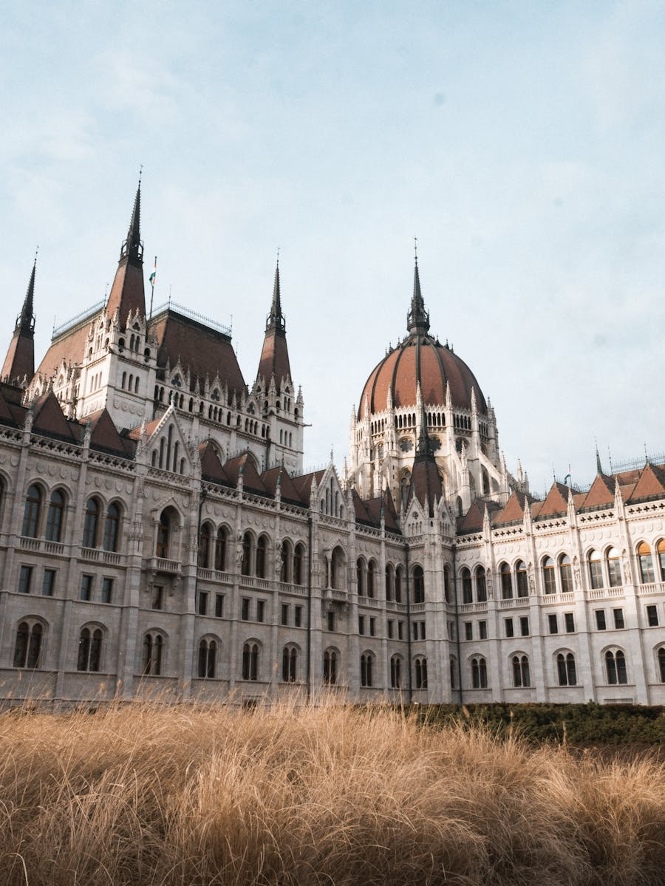

- **Address:** Kossuth Lajos tér 1-3, 1055 Budapest
- **Map:** [Open in Google Maps](https://maps.google.com/?q=Hungarian+Parliament+Building+Budapest)
- **Hours:** Daily 8:00–18:00 (tour times vary by language)
- **Tickets:** ~10,000 HUF for non-EU visitors; book at [jegymester.hu/parlament](https://www.jegymester.hu/parlament) 1–2 weeks ahead

The third-largest parliament in the world and Budapest's defining silhouette — 691 rooms, 88 statues, and the Holy Crown of Hungary on display. The 50-minute guided interior tour walks you through the Grand Staircase, the dome hall (where the crown sits under armed guard), and the old Upper House Chamber.

**Highlights & tips**
- Arrive 30 min early for the **changing of the guard** outside the crown room (every hour on the hour).
- Best photo spot is **across the river on the Buda side** at Batthyány tér — come back for sunset.
- Don't miss the **Kossuth Memorial** and the **Shoes on the Danube** memorial just south along the embankment.

**Practical info**
- **Get there:** Metro **M2 (red line) → Kossuth Lajos tér** station — the exit lifts you up directly under the building. From most central hotels it's 10–15 min by metro.
- **Nearest washroom:** Free, clean toilets inside the **Visitor Centre** (north entrance) are available once you've passed security with your tour ticket. Outside, paid public WC (200 HUF) on the south side of Kossuth tér near the tram stop.
- **Quick bite nearby:** **Kávézó in the Visitor Centre** for coffee + sandwiches. For a sit-down breakfast, **Buja Disznók** (Hold u. 13) — a bistro in the nearby market hall — is a 6-min walk south and serves langos for breakfast.

### Late Morning · St. Stephen's Basilica & Liberty Square

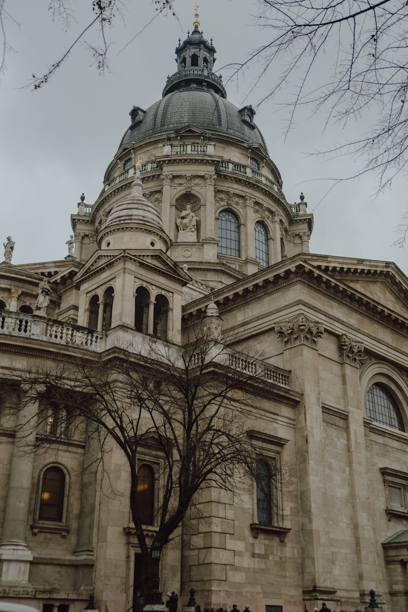

- **Address:** Szent István tér 1, 1051 Budapest
- **Map:** [Open in Google Maps](https://maps.google.com/?q=St+Stephens+Basilica+Budapest)
- **Hours:** Mon–Sat 9:00–17:45, Sun 13:00–17:45
- **Entry:** Suggested donation 1,500 HUF; **dome (panoramic terrace) 3,200 HUF**

Hungary's largest church, named for King Stephen I — whose mummified right hand (the "Holy Right") is kept here in a reliquary. The dome is exactly 96 m tall, matching the Parliament; both are capped at the height of the year 896 when Magyars settled the Carpathian Basin.

**Highlights & tips**
- Drop a 200 HUF coin in the slot beside the **Holy Right** to light the relic for a minute.
- Take the **elevator + 42 steps** (or all 364 stairs) to the dome for a 360° panorama.
- Walk 3 minutes to **Liberty Square (Szabadság tér)** for the dancing fountain and the controversial **Soviet Liberation Monument** opposite the **U.S. Embassy and Reagan statue**.

**Practical info**
- **Get there:** From the Parliament, walk **8 min south down Október 6 utca**. Or hop one stop on metro M2 to **Arany János utca** (3-min walk from the basilica).
- **Nearest washroom:** Free WC inside the basilica's **lower crypt level** if you have a dome ticket. Otherwise, paid WC (300 HUF) at the small public facility on the corner of **Sas utca** behind the basilica.
- **Quick bite nearby:** **First Strudel House of Pest** (Október 6 u. 22) for handmade rétes (strudel, ~1,500 HUF). **Stand 25 Bistro** (Hold u. 13) Michelin Bib Gourmand if you want a memorable lunch instead of the Market Hall plan below.

### Lunch · Great Market Hall (Nagy Vásárcsarnok)

- **Address:** Vámház körút 1-3, 1093 Budapest
- **Map:** [Open in Google Maps](https://maps.google.com/?q=Great+Market+Hall+Budapest)
- **Hours:** Mon 6:00–17:00, Tue–Fri 6:00–18:00, Sat 6:00–15:00. **Closed Sundays.**

A neo-Gothic indoor market from 1897, three floors of paprika, salami, Tokaji wine, and souvenirs. Locals shop on the ground floor; the **upstairs gallery** is the food court.

**Highlights & tips**
- Order **lángos** (deep-fried dough with sour cream + cheese, ~2,000 HUF) at one of the upstairs counters — cash often preferred.
- Try **chimney cake (kürtőskalács)**, stuffed cabbage, or a **goulash** bowl. Skip the ground-floor "tourist goulash" stalls; the upstairs ones are better.
- Buy **paprika** and **Tokaji Aszú dessert wine** as souvenirs — duty-free from local producers, half the airport price.

**Practical info**
- **Get there:** From the basilica, **15-min walk south down Váci utca** (a fine warm-up for this afternoon's stretch). Or take **metro M3/M4 → Kálvin tér** then 4-min walk; or **tram 47/49** straight to Fővám tér in front of the hall.
- **Nearest washroom:** **Paid WC (250 HUF)** in the basement of the market hall — entrance from the central staircase. Bring coins.
- **Quick bite nearby:** Eat *inside* — that's the plan. Best upstairs stalls: **Lángos Sarok** (the corner stand with the queue) and **Fakanál Étterem** (sit-down Hungarian canteen, mains 2,800–4,500 HUF). For dessert, the **kürtőskalács** stall at the back grills them fresh on charcoal.

### Afternoon · Váci Street + a Mini-Statue Hunt

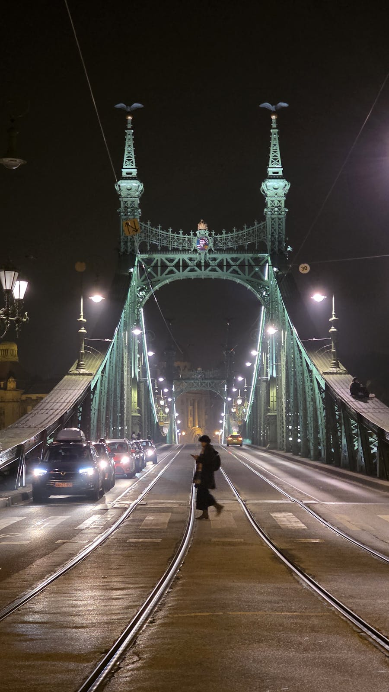

- **Map:** [Váci utca on Google Maps](https://maps.google.com/?q=Vaci+utca+Budapest)
- **Kolodko statue map:** [kolodko.hu](https://kolodko.hu/) (English version with map)

Walk Váci Street (Budapest's main pedestrian shopping spine) north toward Vörösmarty Square. Along the way, hunt for sculptor **Mihály Kolodko's tiny bronze figures** — there are 50+ scattered across the city, usually 10–20 cm tall, hiding on railings, ledges, and street corners. They reference Hungarian pop culture, history, and dark humor.

**Five easy ones to spot near Váci/Vörösmarty:**
- **Tank** — on the curb at Vörösmarty tér 7 (commemorates the 1956 Revolution).
- **Princess (Kis Királylány)** — on the tram-track railing near Vigadó tér.
- **Cradle with Franz Joseph** — near the embankment, "old emperor in a cradle."
- **Teddy Bear** — peeks out near Erzsébet tér.
- **Diver in New York Café window** — small bronze swimmer; you'll see it at tomorrow's coffee stop.

**Practical info**
- **Get there:** Just walk north on **Váci utca** (pedestrian, no transit). It's ~1.2 km from the Market Hall to Vörösmarty tér — about 20 min with stops.
- **Nearest washroom:** **Free WC inside Hard Rock Café Budapest** (Deák Ferenc u. 23) if you order anything; or paid WC inside **Westend City Center** mall a metro stop away. Quickest free option: any McDonald's on the route — there's one at **Erzsébet tér**.
- **Quick bite nearby:** **Gerbeaud** (Vörösmarty tér 7-8) for an Esterházy slice on the terrace if you want to coffee-break before New York Café. Cheaper: **Molnár's Kürtőskalács** (Váci u. 31) for a fresh chimney cake to walk with.

### Coffee Break · New York Café

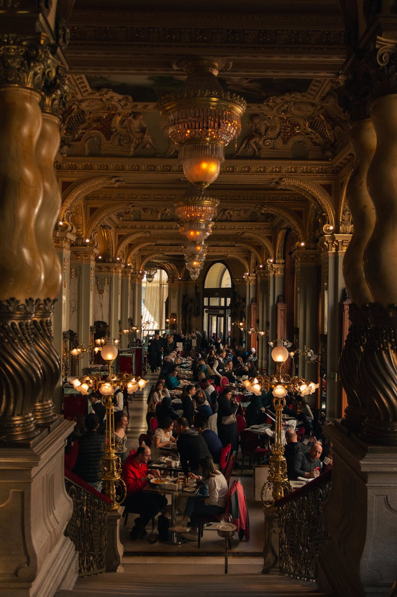

- **Address:** Erzsébet körút 9-11, 1073 Budapest
- **Map:** [Open in Google Maps](https://maps.google.com/?q=New+York+Cafe+Budapest)
- **Hours:** Daily 8:00–24:00
- **Reservation:** Strongly recommended via [newyorkcafe.hu](https://newyorkcafe.hu)

Often called "the most beautiful café in the world" — opened in 1894, all gilded ceilings, marble columns, and frescoes. Yes, it's touristy and overpriced (a coffee + cake set runs ~10,000 HUF). Yes, you should still go once.

**Highlights & tips**
- **Reserve the gallery floor** — the ground floor gets crowded and the best ceiling views are from above.
- Order the **Dobos Torte** or the **New York Cake** (signature layered chocolate-walnut creation).
- Spot the **Kolodko diver** in a small basement window outside before going in.
- If the queue is brutal, **Centrál Kávéház** (Károlyi utca 9) is just as historic, half the price, half the wait.

**Practical info**
- **Get there:** From Vörösmarty tér, take **metro M1 (yellow, the historic line)** two stops to **Oktogon**, then walk 4 min south on Erzsébet körút. Or **tram 4/6** along the Grand Boulevard, get off at Wesselényi utca.
- **Nearest washroom:** Free, opulent WCs **inside the café** (in the basement, gilded mirrors and all — many people visit just for the toilet photo). Bathroom attendant tip 200 HUF appreciated.
- **Quick bite nearby:** You're at the café — order. If skipping it, **Gettó Gulyás** (Wesselényi u. 18) two blocks south does excellent goulash for ~3,500 HUF. **Anna Caffe** (Erzsébet krt. 50) is a budget alternative for cake + coffee at 1/4 the price.

### Evening · Chain Bridge & Shoes on the Danube

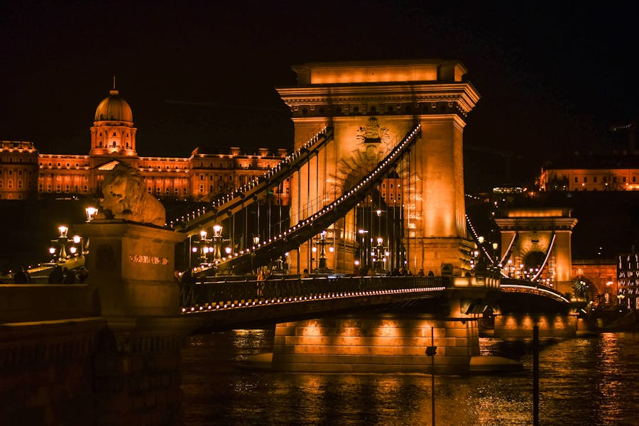

- **Chain Bridge map:** [Széchenyi Lánchíd on Google Maps](https://maps.google.com/?q=Szechenyi+Chain+Bridge+Budapest)
- **Shoes on the Danube map:** [Open in Google Maps](https://maps.google.com/?q=Shoes+on+the+Danube+Bank)

Walk north along the Pest embankment as the sun sets. The **Shoes on the Danube Bank** is a haunting 60-pair iron memorial to Jews shot into the river in 1944–45 — leave a small stone or candle. A few minutes further is the **Széchenyi Chain Bridge** (1849), Hungary's first permanent Danube crossing, recently re-opened after a multi-year renovation. Cross to the Buda side around blue hour for the **best night photos of the lit-up Parliament**.

**Optional cap:** A 70-minute **Legenda Danube night cruise** (departs from Dock 7, Jane Haining rakpart) at ~21:00 — drink-included tickets ~5,500 HUF — gives you the entire skyline, gilded for an hour.

**Practical info**
- **Get there:** From New York Café, **tram 4/6** to **Oktogon**, then **metro M1 → Vörösmarty tér** and walk down to the river (8 min total). Or simply walk back down Andrássy — 25 min, mostly downhill.
- **Nearest washroom:** Free WC at **Vigadó concert hall lobby** (Vigadó tér 2) during business hours; otherwise the **Marriott Hotel lobby** on the embankment is reliably nice if you walk in like a guest. Several paid public WCs (300 HUF) are tucked along the Danube promenade near tram 2 stops.
- **Quick bite / dinner nearby:** **Pesti Disznó** (Nagymező u. 19) for modern Hungarian charcuterie, or **Belvárosi Disznótoros** (Király u. 1-3) — pick-your-cut counter, weigh, eat. For something easy after the cruise: **Bors GasztroBár** (Kazinczy u. 10), a tiny soup + baguette stop near Szimpla.

---

## Day 2 — Buda Side: Castle Hill, Gellért & a Thermal Bath

Today is hilly: comfortable shoes, layers, and bring a swimsuit + flip-flops + a small towel for the bath in the late afternoon.

### Morning · Buda Castle (Royal Palace) & Castle Hill

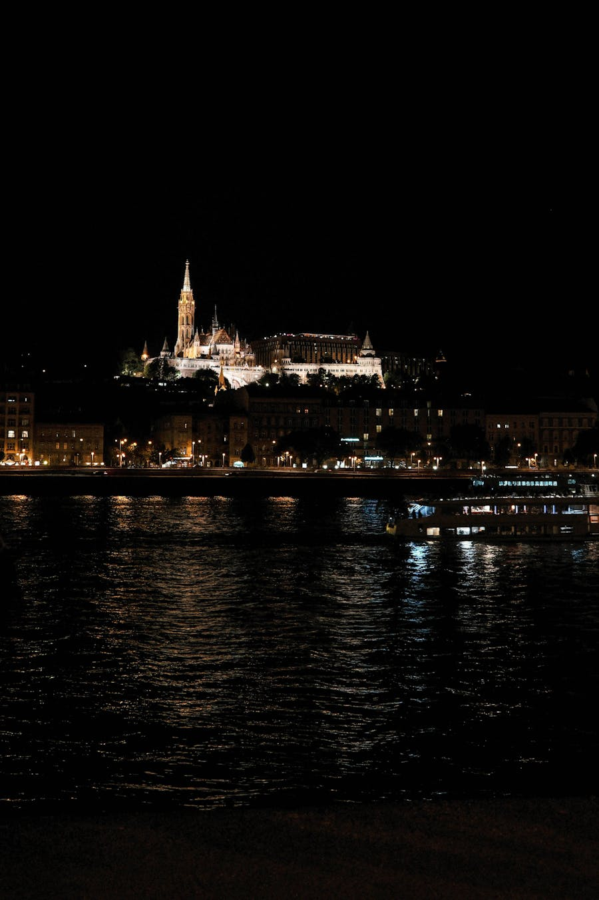

- **Address:** Szent György tér 2, 1014 Budapest
- **Map:** [Open in Google Maps](https://maps.google.com/?q=Buda+Castle)
- **Hours:** Castle grounds always open, free. National Gallery & History Museum 10:00–18:00, closed Mon.

Cross the Chain Bridge and ride the **Budavári Sikló funicular** (4,500 HUF return, 1.5 min) up to Castle Hill — or save the cash and take Bus 16 from Deák tér. Once on top, wander the cobbled streets: the **Royal Palace**, **Sándor Palace** (the President's residence — watch the 12:00 changing of the guard), the **Castle Theatre**, and the **Grand Bazaar Gardens** (Várkert Bazár) on the descent.

**Highlights & tips**
- The **Hungarian National Gallery** inside the palace is free with a Budapest Card; otherwise ~3,800 HUF.
- Walk to **Tóth Árpád sétány** on the western rampart — quieter, with views over Buda Hills, and far fewer tourists than the eastern side.
- Look for the **bronze turul bird** with a sword above the funicular landing — symbol of Hungarian conquest.

**Practical info**
- **Get there:** From your hotel, **metro M1/M2/M3 → Deák Ferenc tér**, then **bus 16** straight to "Dísz tér" on Castle Hill (5 min, ride included in your travel card). The funicular costs extra and queues 30+ min in spring; the **Várkert Bazár escalators** from the riverside are free and almost as quick.
- **Nearest washroom:** **Free WC inside the National Gallery** with a ticket. Free public WCs in the **courtyard between Wing C and Wing D** of the palace (signed). Paid WC (300 HUF) at Dísz tér.
- **Quick bite nearby:** **Walzer Café** (Táncsics Mihály u. 12) for coffee and apple strudel. **Vár Bistro** (Hess András tér 1-3) for a quick goulash bowl at 2,800 HUF. **Ruszwurm** (Szentháromság u. 7) is the legendary 1827 confectionery — tiny, no-reservations, come for cremes and an espresso.

### Late Morning · Matthias Church & Fisherman's Bastion

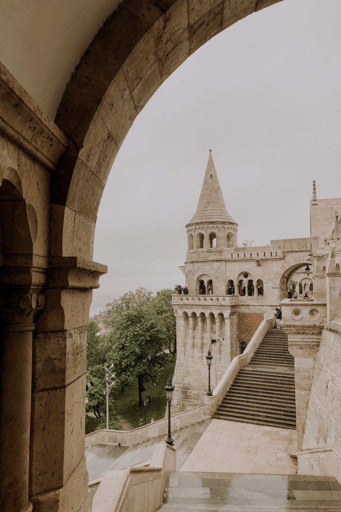

- **Address:** Szentháromság tér, 1014 Budapest
- **Map:** [Open in Google Maps](https://maps.google.com/?q=Fishermans+Bastion+Budapest)
- **Hours:** Bastion open 24/7. **Upper terraces 1,500 HUF** between 9:00–19:00 (free before 9:00 and after 19:00 in spring).
- **Matthias Church:** Mon–Fri 9:00–17:00, Sat 9:00–13:00, Sun 13:00–17:00. Entry ~2,500 HUF.

Seven white neo-Romanesque turrets representing the seven Magyar tribes — an over-the-top fairy-tale viewpoint over the Parliament and the Danube. Right next to it stands **Matthias Church**, where Hungarian kings were crowned for 700 years; the diamond-patterned tile roof is unmistakable.

**Highlights & tips**
- **Free trick:** Enter before 9:00 (or after 19:00) to walk the upper terraces without paying.
- The **best photo angle** is from the lower turret looking up, framing the church behind.
- Inside Matthias Church, climb the **bell tower** (extra 1,500 HUF) for a different angle on the rooftops.

**Practical info**
- **Get there:** From the Royal Palace, walk **8 min north along Tárnok utca** through the cobbled old-town. No transit needed — Castle Hill is compact.
- **Nearest washroom:** **Paid WC (300 HUF)** in the small building at Szentháromság tér just behind the bastion (where the tour buses park). Free WC with church ticket at the Matthias Church side entrance.
- **Quick bite nearby:** **Café Pierrot** (Fortuna u. 14) — historic 18th-century courtyard café, great for a coffee + walnut cake. For sweets, hit **Ruszwurm** (Szentháromság u. 7) right between the bastion and Matthias Church.

### Hidden Gem · Hospital in the Rock (Sziklakórház)

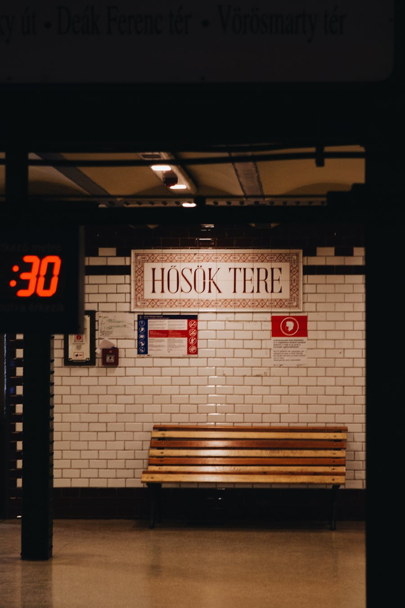

- **Address:** Lovas út 4/c, 1012 Budapest
- **Map:** [Open in Google Maps](https://maps.google.com/?q=Hospital+in+the+Rock+Budapest)
- **Hours:** Daily 10:00–19:00. Tours every hour on the hour.
- **Tickets:** ~7,000 HUF; **only by guided tour, 1 hour, English**

Beneath Castle Hill runs a 10-km natural cave network. In WWII it was converted into a secret emergency hospital and air-raid shelter; in the Cold War it was retrofitted as a nuclear bunker. Wax figures, original surgical equipment, and Geiger counters fill the rooms — eerie, claustrophobic, fascinating.

**Highlights & tips**
- Wear a **light jacket** — it's a constant 14°C inside.
- Photography is **not allowed** — put your camera away before the tour.
- Combine with a 5-minute walk to the **Buda Castle Labyrinth** entrance if you want more underground.

**Practical info**
- **Get there:** From Fisherman's Bastion, walk **5 min west on Lovas út** along the rampart. The entrance is a small white-painted door cut into the cliff — easy to miss; look for the brown sign.
- **Nearest washroom:** **Free WC inside the museum lobby** (use it before your tour starts — you can't leave once the guide begins).
- **Quick bite nearby:** **Anjuna Café** (Lovas út 41) for sandwiches and a panoramic terrace. Or descend to **Batthyány tér** (10 min) for the small market hall's lángos counter — cheap, fast, full lunch under 3,000 HUF.

### Lunch · Ruszwurm or Halászbástya Restaurant

- **Ruszwurm** — Hungary's oldest confectionery (1827). Address: Szentháromság u. 7. Tiny, no reservations; come for **cremes** (creamy pastry) and a coffee, not a full meal.
- **Halászbástya Étterem** — fine-dining inside one of the bastion turrets, river view, prix-fixe ~25,000 HUF. Reserve ahead.
- **Budget option:** Walk down to **Batthyány tér** and grab a **lángos** at the small market hall there.

**Practical info**
- **Get there:** Ruszwurm and Halászbástya are both on Castle Hill, no transit needed. For Batthyány, walk down the **Király lépcső** (King's Steps) — 10 min descent on stone steps cut into the hillside.
- **Nearest washroom:** Restaurant customers use the in-house facilities. The **Batthyány tér market hall** has a paid WC (200 HUF) on the lower floor.

### Afternoon · Gellért Hill & the Citadella

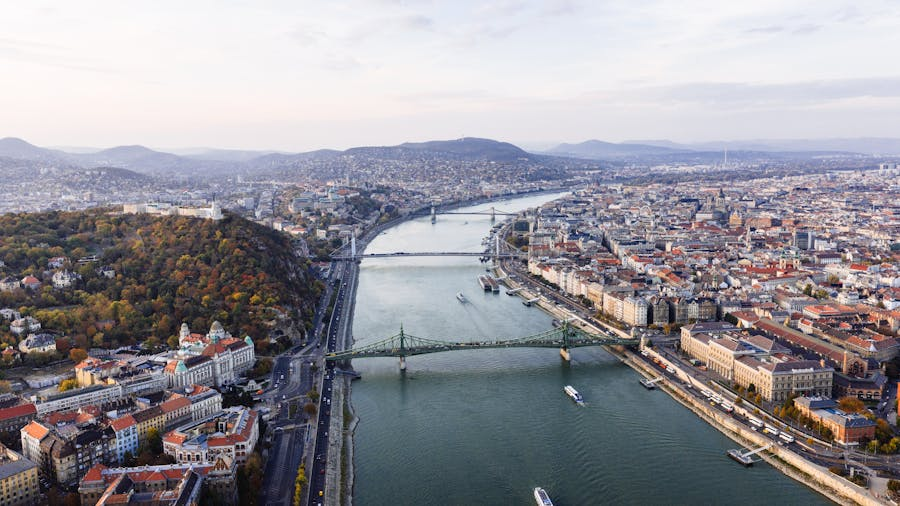

- **Address:** Citadella sétány, 1118 Budapest
- **Map:** [Open in Google Maps](https://maps.google.com/?q=Gellert+Hill+Citadella)
- **Hike time:** 25–30 min from the Liberty Bridge / Gellért Bath base
- **Cost:** Free

Cross the **Liberty Bridge (Szabadság híd)** — the green wrought-iron gem of the Danube — and start the switchback path up Gellért Hill. The summit is crowned by the **Liberty Statue** (a 14-m bronze woman holding a palm leaf, originally a 1947 Soviet monument). The **Citadella fortress** is being renovated through 2026, but the surrounding terraces are open and offer the **single best panoramic view of Budapest** — both Buda's red rooftops and Pest's parliament line up across the river.

**Highlights & tips**
- Halfway up, detour to the **Cave Church (Sziklatemplom)** — a working Pauline monastery built into the hillside (entry ~700 HUF).
- Look for the **Gellért statue and waterfall** on the eastern slope — the bishop after whom the hill is named was rolled down it in a barrel by pagan Magyars in 1046.
- Stay for **sunset** if you skipped the night cruise yesterday.

**Practical info**
- **Get there:** From Castle Hill, walk down to **Clark Ádám tér** (foot of Chain Bridge), then **bus 8E or 110** along the Buda riverbank to **Szent Gellért tér** (5 min). Or simply walk along the river — 25 min south. The hike up the hill from there is 25–30 min on switchback paths.
- **Nearest washroom:** No public WC on the summit. Plan ahead — use the WC at **Gellért Bath lobby** (free if you have a bath ticket later) or the café at **Citadella's base** before climbing. There is a small, sometimes-open paid WC near the Liberty Statue (300 HUF).
- **Quick bite nearby:** Pack water and a snack for the climb. At the base, **Hadik Kávéház** (Bartók Béla út 36) is a relaxed Buda-side café for coffee + cake. **Kelet Kávézó és Galéria** (Bartók Béla út 29) does excellent breakfast plates 2,500–4,000 HUF.

### Late Afternoon · Gellért Thermal Bath

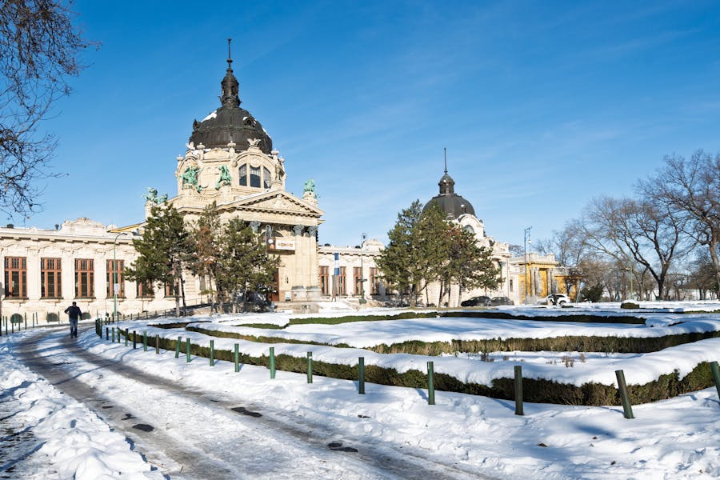

- **Address:** Kelenhegyi út 4, 1118 Budapest
- **Map:** [Open in Google Maps](https://maps.google.com/?q=Gellert+Thermal+Bath+Budapest)
- **Hours:** Daily 9:00–19:00 (last entry 18:00)
- **Tickets:** ~9,800 HUF weekday with cabin, ~10,500 HUF weekend; book at [gellertbath.hu](https://www.gellertbath.hu)

Right at the foot of the hill, this 1918 Art Nouveau bath is the most photogenic in the city: stained-glass dome, mosaic floors, columns. **Széchenyi** (over in City Park) is bigger and has the iconic yellow exterior, but Gellért is closer, smaller, and architecturally jaw-dropping.

**Highlights & tips**
- Bring a **swimsuit, flip-flops, towel** (rentals available but pricey). A swim cap is required only in the lap pool.
- Hop between the **38°C indoor thermal pool**, the **outdoor wave pool** (spring-temperature dependent), and the **steam room**. The **rooftop sun terrace** is open if the weather is mild.
- Allow **2–3 hours**. Stay hydrated — the thermal water is mineralized and warm.

**Practical info**
- **Get there:** The bath is at the foot of Gellért Hill. From the summit, walk down the eastern path (20 min) to **Szent Gellért tér** — bath entrance is on Kelenhegyi út, around the side of the iconic Hotel Gellért.
- **Nearest washroom:** Free WCs inside the bath complex (in every changing-room cluster). For the brief gap between leaving and dinner, the metro **M4 Szent Gellért tér** station has free toilets.
- **Quick bite / drink:** **Hotel Gellért's Espresso Bar** (lobby) for a quick post-soak coffee. The bath itself has a small **bistro counter** for sandwiches, beers, and bottled water — pricey but convenient. For a real meal, take **tram 19/41/56** one stop to **Móricz Zsigmond körtér** for **Hadik Kávéház** (above) or **Hummusbar** (vegetarian fast-casual).

### Evening · Dinner + a Ruin Bar

After the bath you'll be relaxed and starving. Take the tram 2 along the riverbank back to Pest.

- **Dinner:** **Hungarikum Bisztró** (Steindl Imre u. 13) for traditional goulash, chicken paprikash, and Tokaji — book ahead. **Mazel Tov** (Akácfa u. 47) for Israeli/Mediterranean in a stunning courtyard ruin bar.
- **Ruin bar:** **Szimpla Kert** (Kazinczy u. 14) — the original ruin pub, a maze of mismatched furniture, a Trabant car turned booth, and live music nightly. Map: [Szimpla Kert on Google Maps](https://maps.google.com/?q=Szimpla+Kert+Budapest).

**Practical info**
- **Get there:** From Gellért Bath, **tram 47/49** across the Liberty Bridge to Deák tér (10 min), then walk into the Jewish Quarter (Kazinczy utca, the ruin-bar street, is 8 min on foot). Or **night bus 907** if you stay out past tram hours.
- **Nearest washroom:** Free WCs in any restaurant/bar where you're a customer. Szimpla Kert's WCs are famously decorated — go in even if you only have a drink. **Karaván street-food court** next door has shared paid WCs (300 HUF).
- **Late snack:** **Karaván Street Food** (Kazinczy u. 18) open till 02:00 — gyros, lángos, falafel, beer. **Mazel Tov** doubles as kitchen + bar till midnight.

---

## Day 3 — Hidden Budapest, City Park & a Final Soak

Slower pace. Cherry blossoms, scattered curiosities, and the grand Széchenyi bath at sunset.

### Morning · Margaret Island (Margitsziget)

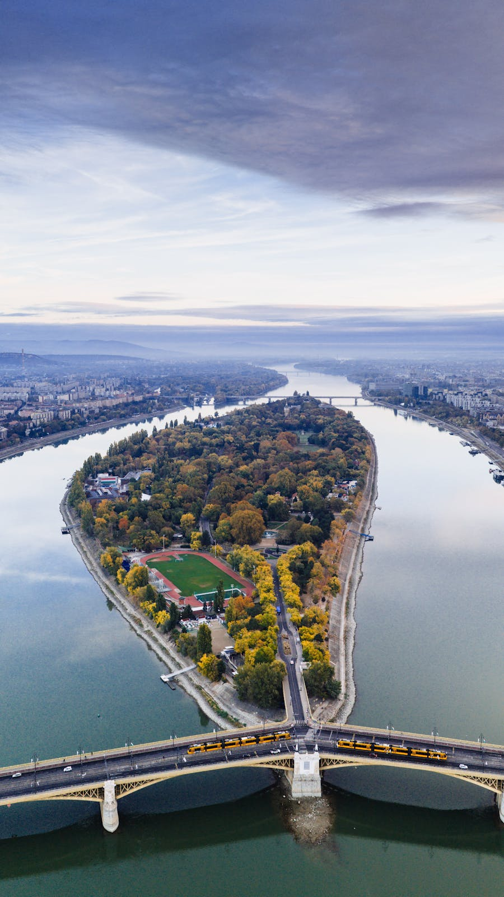

- **Address:** Margitsziget, 1138 Budapest
- **Map:** [Open in Google Maps](https://maps.google.com/?q=Margaret+Island+Budapest)
- **How to get there:** Tram 4 or 6 stops on the **Margaret Bridge** mid-river; walk down to the island. Free.

A 2.5 km car-free island in the middle of the Danube — locals' weekend escape. In April–May, the **cherry trees in the Japanese Garden** are in full bloom and the **musical fountain** restarts its choreographed shows for the season.

**Highlights & tips**
- Rent a **Bringóhintó** (4-wheel pedal cart) at the southern entrance — ~4,000 HUF/hour, fits 2–4 people. Or rent a regular bike for ~2,000 HUF.
- Walk loop: **musical fountain → ruins of the Dominican convent (where Princess Margaret lived) → Japanese Garden with cherry blossoms → mini zoo with deer and peacocks**.
- The **water tower** on the eastern side has a small free observation deck (UNESCO listed).

**Practical info**
- **Get there:** **Tram 4 or 6** stops mid-bridge at **Margitsziget** — walk down the staircase to the southern tip of the island. Bus **26** runs the length of the island if you don't want to walk it all.
- **Nearest washroom:** **Free public WCs** scattered along the central path: one near the musical fountain, one by the rose garden, one at the northern bridge. Most are open 8:00–20:00 in spring.
- **Quick bite nearby:** **Holdudvar** (Magitsziget) — restaurant + open-air bar, 2,500–4,500 HUF mains, perfect for a relaxed brunch. Several **kürtőskalács** stalls along the southern walking path. **Robinson** restaurant has a lake-side terrace if you want a sit-down lunch.

### Mid-Morning · House of Terror

- **Address:** Andrássy út 60, 1062 Budapest
- **Map:** [Open in Google Maps](https://maps.google.com/?q=House+of+Terror+Budapest)
- **Hours:** Tue–Sun 10:00–18:00. Closed Mondays.
- **Tickets:** ~4,000 HUF; audio guide ~1,500 HUF (essential)

This building — the former HQ of the Hungarian Nazi Arrow Cross and later the Communist secret police (ÁVH) — is now a museum about 20th-century Hungarian totalitarianism. The basement still contains the original interrogation cells. Heavy and important.

**Highlights & tips**
- **Audio guide is essential** — most exhibit text is Hungarian only.
- Allow **2 hours**. The basement is the emotional climax — don't rush it.
- Walk to **Heroes' Square** at the end of Andrássy út afterward — ~20 min stroll up the UNESCO-listed boulevard.

**Practical info**
- **Get there:** From Margaret Island's southern bridge, **tram 4/6** to **Oktogon**, then walk 2 min east on Andrássy. Or take **metro M1 (yellow line) → Vörösmarty utca** — exit lifts you a block from the museum.
- **Nearest washroom:** Free WC inside the museum lobby (with ticket). After visiting, the **Liszt Ferenc tér** café cluster has plenty of options — buy a coffee, use the WC.
- **Quick bite nearby:** Skip the museum café — overpriced and unremarkable. Instead, walk to **Liszt Ferenc tér** (5 min) for **Klassz** (Andrássy út 41) — well-priced modern Hungarian, no reservations, 4,500–7,000 HUF for two courses.

### Lunch · A Historic Coffee House on Andrássy

Pick one of these, all on or just off Andrássy út:

- **Művész Kávéház** (Andrássy út 29) — 1898 grand café opposite the Opera, more relaxed than New York Café and a quarter the price.
- **Centrál Kávéház** (Károlyi u. 9) — 1887, beloved by writers like Ady and Karinthy. Their **veal goulash** is excellent. [Map](https://maps.google.com/?q=Centrall+Kavehaz+Budapest)
- **Gerbeaud** (Vörösmarty tér 7-8) — since 1858, famous for its layered **Esterházy torte** and the Christmas-market cabin out front.

**Practical info**
- **Get there:** All three are on **metro M1 (yellow line)** stops — Művész at "Opera", Centrál is a 5-min walk from "Vörösmarty tér", Gerbeaud is right at "Vörösmarty tér". M1 itself is a UNESCO-listed sight (Europe's oldest electric metro, 1896).
- **Nearest washroom:** Free WCs inside any of the three cafés as a customer.
- **Tipping note:** Even with a service charge, leave 200 HUF in a coffee house — staff appreciate it for the slow-paced "afternoon coffee culture."

### Afternoon · Heroes' Square + City Park (Városliget)

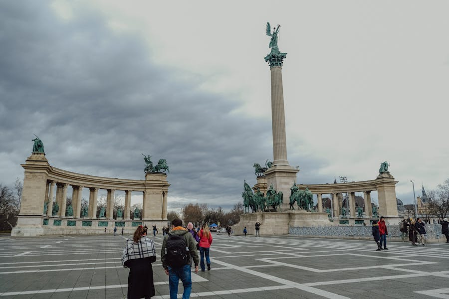

- **Heroes' Square address:** Hősök tere, 1146 Budapest
- **Map:** [Open in Google Maps](https://maps.google.com/?q=Heroes+Square+Budapest)
- **Cost:** Free

The grandest square in Budapest, anchored by the **Millennium Monument** with the seven Magyar chieftains on horseback. Flanked by the **Museum of Fine Arts** and the **Műcsarnok (Hall of Art)**. Behind the square is **Városliget (City Park)**, home to:

- **Vajdahunyad Castle** — a fairytale Disney-esque mash-up of every Hungarian architectural era; free to wander the grounds, paid entry to the Agriculture Museum inside.
- **Boating lake** (in spring) — rent a rowboat; in winter it's the city's main outdoor ice rink.
- **Time Wheel** — one of the world's largest hourglasses, rotated once a year on Dec 31.

**Practical info**
- **Get there:** From your coffee-house lunch, walk Andrássy boulevard north (~25 min) or take **metro M1 → Hősök tere** (3 min). The metro exit lifts you out at the foot of the millennium monument.
- **Nearest washroom:** Free WCs inside the **Museum of Fine Arts** (Hősök tere) and **Műcsarnok** (with ticket). Paid WC (300 HUF) at the **Vajdahunyad Castle ticket office**. Several public WCs near the boating lake (200 HUF).
- **Quick bite nearby:** **Robinson** by the lake — pricey but iconic. **Bagolyvár** (Owl Castle, Állatkerti krt. 2) is a women-run restaurant from the same group as the famous Gundel — excellent honest Hungarian cooking, mains 4,800–7,000 HUF, no service charge so tip generously.

### Quirky Detour · The "World's Coolest McDonald's"

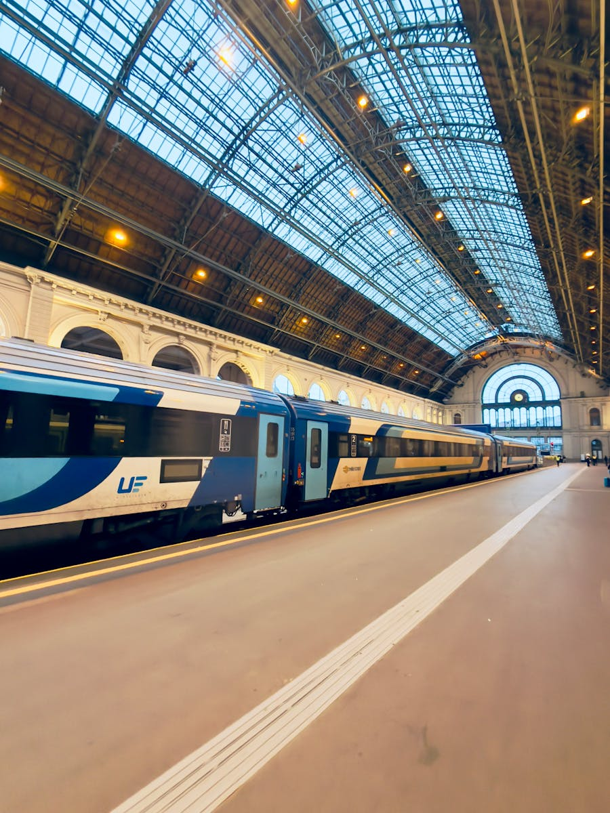

- **Address:** Teréz krt. 55 (inside Nyugati Railway Station), 1062 Budapest
- **Map:** [Open in Google Maps](https://maps.google.com/?q=Nyugati+McDonalds+Budapest)
- **Hours:** Daily 6:00–24:00

Worth a five-minute detour for the photo: this McDonald's occupies the **former royal waiting hall** of Nyugati Station, designed by the Eiffel Company in 1877. Crystal chandeliers, painted ceilings, gilded mirrors — all over your Big Mac. Even if you don't eat, walk in for a look and find the **Kolodko mini-statue of the train driver** outside.

**Practical info**
- **Get there:** From Heroes' Square area, **metro M1 → Deák Ferenc tér**, transfer to **M3 (blue line) → Nyugati pályaudvar** (3 min). Or **tram 4/6** from Oktogon — two stops to Nyugati.
- **Nearest washroom:** **Paid WC (300 HUF)** in the main station hall, signposted near the platforms. Free WC inside the McDonald's itself with any purchase.
- **Quick bite nearby:** Obviously the McDonald's if you want the experience. Otherwise, **Westend City Center** mall is right next door with a full food court — try **Bambi Eszpresszó** for retro communist-era goulash kitsch (Frankel Leó út, but a tram ride away if you want the OG experience).

### Late Afternoon → Evening · Széchenyi Thermal Bath at Sunset

- **Address:** Állatkerti krt. 9-11, 1146 Budapest (inside City Park)
- **Map:** [Open in Google Maps](https://maps.google.com/?q=Szechenyi+Thermal+Bath+Budapest)
- **Hours:** Daily 7:00–19:00 (last entry 18:00). Some Saturdays have late "Sparty" parties till 03:00.
- **Tickets:** ~10,500 HUF weekday, ~11,500 HUF weekend with cabin; book at [szechenyibath.hu](https://www.szechenyibath.hu)

The picture-postcard yellow neo-Baroque bath complex — 18 pools, 10 saunas, three huge outdoor pools open year-round. The famous shot is the two old men playing chess in the steaming outdoor water. In spring evenings, when the air is cool and the pools steam, it's magical.

**Highlights & tips**
- Go around **17:00** to bathe through golden hour and the lighting of the bath at sunset.
- The **outdoor whirlpool current** is delightful — it spins you in a circle.
- Bring **2× 200 HUF coins** for the lockers (you'll get one back when you return the bracelet).
- Allow **2–3 hours**. After, you're a 5-minute walk to the City Park metro for an easy ride back.

**Practical info**
- **Get there:** From Nyugati, **metro M3 → Deák Ferenc tér**, transfer to **M1 (yellow) → Széchenyi fürdő**. Total ~12 min, exit puts you 2 min walk from the bath entrance. The yellow building is unmissable.
- **Nearest washroom:** Free WCs inside the bath in every changing-room block. Free WCs at the City Park café cluster by the lake.
- **Refuel afterwards:** **Pántlika Bisztró** in the park — 1960s pavilion turned bistro, great for a lángos + beer post-bath. **Robinson** lake-side if you want a sit-down meal. **Kürtős Kalács stalls** outside the bath sell warm chimney cake until ~20:00.

### Farewell Dinner · Goulash & Tokaji

A few solid final-night picks:

- **Stand 25 Bistro** (Hold u. 13) — modern Hungarian, Michelin Bib Gourmand, ~12,000 HUF for two courses + wine. Reserve.
- **Karaván Street Food** (Kazinczy u. 18) — open-air food court next to Szimpla Kert; lángos, gyros, chimney cake, Hungarian craft beer. Cheap and lively.
- **Frici Papa** (Király u. 55) — old-school Hungarian canteen prices (mains 2,500 HUF), goulash and stuffed cabbage that locals actually order. Cash only.

**Practical info**
- **Get there:** From Széchenyi, **metro M1 → Vörösmarty tér** for the Pest centre options. All three restaurants are walkable from there: Stand 25 (15 min), Karaván (12 min), Frici Papa (10 min).
- **Nearest washroom:** Restaurant-customer WCs at all three. Public paid WC (200 HUF) at **Deák Ferenc tér metro station**.

Cap the night by walking back to the **Chain Bridge** for one last shot of the lit Parliament across the water. Egészségedre! 🇭🇺

---

## Quick Reference: All Locations on One Map

For convenience, here are direct Google Maps links to every stop in this itinerary:

| Day | Stop | Map |
|-----|------|-----|
| 1 | Hungarian Parliament | [link](https://maps.google.com/?q=Hungarian+Parliament+Building+Budapest) |
| 1 | St. Stephen's Basilica | [link](https://maps.google.com/?q=St+Stephens+Basilica+Budapest) |
| 1 | Liberty Square | [link](https://maps.google.com/?q=Szabadsag+ter+Budapest) |
| 1 | Great Market Hall | [link](https://maps.google.com/?q=Great+Market+Hall+Budapest) |
| 1 | Váci Street | [link](https://maps.google.com/?q=Vaci+utca+Budapest) |
| 1 | New York Café | [link](https://maps.google.com/?q=New+York+Cafe+Budapest) |
| 1 | Shoes on the Danube | [link](https://maps.google.com/?q=Shoes+on+the+Danube+Bank) |
| 1 | Chain Bridge | [link](https://maps.google.com/?q=Szechenyi+Chain+Bridge+Budapest) |
| 2 | Buda Castle | [link](https://maps.google.com/?q=Buda+Castle) |
| 2 | Fisherman's Bastion | [link](https://maps.google.com/?q=Fishermans+Bastion+Budapest) |
| 2 | Matthias Church | [link](https://maps.google.com/?q=Matthias+Church+Budapest) |
| 2 | Hospital in the Rock | [link](https://maps.google.com/?q=Hospital+in+the+Rock+Budapest) |
| 2 | Liberty Bridge | [link](https://maps.google.com/?q=Liberty+Bridge+Budapest) |
| 2 | Gellért Hill / Citadella | [link](https://maps.google.com/?q=Gellert+Hill+Citadella) |
| 2 | Gellért Thermal Bath | [link](https://maps.google.com/?q=Gellert+Thermal+Bath+Budapest) |
| 2 | Szimpla Kert (ruin bar) | [link](https://maps.google.com/?q=Szimpla+Kert+Budapest) |
| 3 | Margaret Island | [link](https://maps.google.com/?q=Margaret+Island+Budapest) |
| 3 | House of Terror | [link](https://maps.google.com/?q=House+of+Terror+Budapest) |
| 3 | Heroes' Square | [link](https://maps.google.com/?q=Heroes+Square+Budapest) |
| 3 | Vajdahunyad Castle | [link](https://maps.google.com/?q=Vajdahunyad+Castle+Budapest) |
| 3 | Nyugati McDonald's | [link](https://maps.google.com/?q=Nyugati+McDonalds+Budapest) |
| 3 | Széchenyi Thermal Bath | [link](https://maps.google.com/?q=Szechenyi+Thermal+Bath+Budapest) |

---

## Source Playlist

All recommendations cross-checked against the YouTube playlist [匈牙利景點攻略 (Hungary Attractions Guide)](https://youtube.com/playlist?list=PLmQssQKbiWpajLj9tiWiz3kWUFKr4TUUk), with episodes covering each individual landmark above plus practical guides on transport, tipping, scams, food streets, and Kolodko's mini-statue trail.
