# Budapest 5-Day Itinerary — May 22–26, 2026

A balanced late-spring tour mixing Pest icons, Buda Castle, thermal baths, hidden courtyards, and a full Szentendre day trip. Built from the YouTube playlist [Budapest / Hungary Travel Guide (Local)](https://youtube.com/playlist?list=PLtV2zB28YXqiyU5iLzzXJNNWn_VRhDrIl).

## Trip parameters

- **Arrival** — Fri 22 May, RJ 1031 from Vienna Hbf, arrives **Budapest Kelenföld 12:58**
- **Hotel** — Astoria area, 1088 Budapest (Palace District / Erzsébetváros border — central, walkable to Jewish quarter, Central Market, palace district)
- **Departure** — Wed 27 May, **AC 9023 BUD 05:55 → FRA 07:40 → YVR**. Be at airport by 04:00 — taxi from hotel ~03:30 (100E airport bus does not run before 04:00)
- **Season** — Late May, 18–25 °C, sunset ~20:30, rose blooms peak on Margaret Island

## Why this shape

- **Day 1 is half-day** (arrive ~13:30 at hotel after train + metro). Compressed Pest icon walk + sunset cruise.
- **Day 4 is Monday**: House of Terror, Hungarian National Museum, House of Music, Museum of Fine Arts all closed. Routed around them — Central Market + Palace District + scenic tram.
- **Day 5 is Tuesday Szentendre full day** (your request). Detailed spot plan below.
- **Wed 5/27 departure is brutal early** — Tue dinner is the farewell meal, not Wed.

**At-a-glance**

| Day | Date | Theme | Anchors | Booked? |
|-----|------|-------|---------|---------|
| 1 | Fri 22 | Arrival → Pest icons → Danube cruise | Basilica, Shoes on Danube, Chain Bridge, sunset cruise | Cruise (online) |
| 2 | Sat 23 | Parliament + Andrássy + Heroes Sq + Bath | Parliament tour 09:00, Andrássy walk, Heroes Sq, House of Music, Széchenyi | **Parliament** + bath cabin |
| 3 | Sun 24 | Buda Castle + Gellért sunset + ruin bars | Matthias Church, Fishermen's Bastion, Hospital in the Rock, Citadella, Szimpla | Hospital in the Rock |
| 4 | Mon 25 | Central Market + Palace District + Margaret Island + Tram 2 | Central Market, Kolodko hunt, Tram 2, Margaret Island fountain | — |
| 5 | Tue 26 | Szentendre day trip + farewell dinner | HÉV out, Templom-domb, Kovács Margit, riverbank | Farewell dinner reserve |
| ✈ | Wed 27 | 03:30 taxi → BUD → 05:55 flight | — | — |

Companion docs: [food.md](food.md) · [phrasebook.md](phrasebook.md) · [washrooms.md](washrooms.md)

## Route maps (Google Maps + printable PDFs)

A multi-stop Google Maps route was built for each day and saved as a one-page PDF in [`routes/`](routes/). Each PDF contains the stops list with addresses, transit/walking estimate, the live Google Maps URL, and a QR code so you can tap-to-navigate from a printed copy.

| Day | Theme | Live route | Printable PDF |
|-----|-------|-----------|---------------|
| 1 — Fri 5/22 | Arrival → Pest icons → cruise | [Open in Google Maps](https://www.google.com/maps/dir/Danubius+Hotel+Astoria,+Budapest,+Kossuth+Lajos+u.+19,+1053+Hungary/Bors+Gastro+Bar,+Budapest,+Kazinczy+u.+10,+1075+Hungary/Shoes+on+the+Danube+Bank,+Budapest,+1054+Hungary/St.+Stephen's+Basilica,+Budapest,+Szent+Istv%C3%A1n+t%C3%A9r+1,+1051+Hungary/Vigad%C3%B3+t%C3%A9r,+Budapest,+Hungary/?travelmode=walking) | [Day 1 route PDF](routes/Day_1_Friday_May22_route.pdf) |
| 2 — Sat 5/23 | Parliament → Andrássy → Heroes Sq → Széchenyi | [Open in Google Maps](https://www.google.com/maps/dir/Astoria,+Budapest/Hungarian+Parliament+Building,+Budapest,+Kossuth+Lajos+t%C3%A9r+1-3,+1055+Hungary/Oktogon,+Budapest,+Hungary/Heroes'+Square,+Budapest,+H%C5%91s%C3%B6k+tere,+1146+Hungary/House+of+Music+Hungary,+Budapest,+Olof+Palme+stny.+3,+1146+Hungary/Sz%C3%A9chenyi+Thermal+Bath,+Budapest,+%C3%81llatkerti+krt.+9-11,+1146+Hungary/Astoria,+Budapest/?travelmode=transit) | [Day 2 route PDF](routes/Day_2_Saturday_May23_route.pdf) |
| 3 — Sun 5/24 | Buda Castle → Bastion → Hospital in the Rock → Gellért | [Open in Google Maps](https://www.google.com/maps/dir/Astoria,+Budapest/Buda+Castle,+Budapest,+Szent+Gy%C3%B6rgy+t%C3%A9r,+1014+Hungary/Fisherman's+Bastion,+Budapest,+1014+Hungary/Hospital+in+the+Rock,+Budapest,+Lovas+%C3%BAt+4%2Fc,+1012+Hungary/Citadel,+Budapest,+Citadella+stny.+1,+1118+Hungary/Szimpla+Kert,+Budapest,+Kazinczy+u.+14,+1075+Hungary/?travelmode=transit) | [Day 3 route PDF](routes/Day_3_Sunday_May24_route.pdf) |
| 4 — Mon 5/25 | Central Market → Palace District → Tram 2 → Margaret Island | [Open in Google Maps](https://www.google.com/maps/dir/Astoria,+Budapest/Great+Market+Hall,+Budapest,+1093+Hungary/Hungarian+National+Museum,+Budapest,+M%C3%BAzeum+krt.+14-16,+1088+Hungary/Vigad%C3%B3+t%C3%A9r,+Budapest,+1051+Hungary/Musical+Well,+Budapest,+1138+Hungary/Astoria,+Budapest/?travelmode=transit) | [Day 4 route PDF](routes/Day_4_Monday_May25_route.pdf) |
| 5 — Tue 5/26 | Szentendre walking loop | [Open in Google Maps](https://www.google.com/maps/dir/Szentendre,+2000+Hungary/Marzipan+Museum+and+Caf%C3%A9,+Szentendre,+Dumtsa+Jen%C5%91+u.+14,+2000+Hungary/F%C5%91+t%C3%A9r,+Szentendre,+2000+Hungary/Blagovestenska+Church,+Szentendre,+F%C5%91+t%C3%A9r+5,+2000+Hungary/Templom+t%C3%A9r,+Szentendre,+Templom+t%C3%A9r,+2000+Hungary/Belgrade+cathedral,+Szentendre,+Alkotm%C3%A1ny+u.,+2000+Hungary/Margit+Kov%C3%A1cs+Ceramic+Museum,+Szentendre,+Vastagh+Gy%C3%B6rgy+u.+1,+2000+Hungary/Szentendre,+2000+Hungary/?travelmode=walking) | [Day 5 route PDF](routes/Day_5_Tuesday_May26_route.pdf) |

**To save these routes inside your Google account** (so they appear in your "Saved" list and on your phone): open each route URL in Chrome while signed in to Google, click the **share icon** at the top of the directions panel, then **Send directions to your phone** — they sync to Google Maps on your device. (I can't sign into your Google account on your behalf for security reasons.)

## Practical basics

- **Currency:** Hungarian Forint (HUF). Cards everywhere; carry ~10,000 HUF cash for markets, public WCs, tips.
- **Transport:** Buy a **Budapest 96-hour travelcard** (~7,500 HUF) at any metro vending machine on Day 1 — covers metro M1–M4, trams, buses, HÉV in zone, boats. Validate paper tickets in the orange box. Day 5 needs a **HÉV suburban supplement** (~750 HUF each way) for Szentendre. Day 6 (airport) needs a **special 100E ticket** (2,200 HUF) — but at 03:30 you'll taxi anyway. Apps: **BudapestGO** (planner + tickets), **BKK Futár** (live arrivals).
- **Tipping:** 10–12 % unless `szervízdíj` already added.
- **Tap water:** Safe; ask `csapvíz` at restaurants for the free version.
- **Reservations needed (book before arrival):**
  - **Parliament tour Sat 09:00 English** — [jegymester.hu/parlament](https://www.jegymester.hu/parlament)
  - **Hospital in the Rock Sun ~14:00** — [sziklakorhaz.eu](https://www.sziklakorhaz.eu/)
  - Sunset **Legenda cruise Fri 20:30** — [legenda.hu](https://www.legenda.hu/)
  - **Tue farewell dinner** — Borkonyha or Halászbástya (2+ weeks ahead)

---

## Arrival — Friday, May 22 — From Kelenföld to Astoria

**12:58 Train arrives Budapest Kelenföld** (south Buda, terminus M4 metro line).

**13:05 → 13:35 — Get to hotel**
- Follow signs **M4 / metró** down from the platform. Buy a **96-hour travelcard** (~7,500 HUF) at the vending machine — same card covers Day 1–4 inside Budapest zone.
- **M4 (green) Kelenföld pályaudvar → Kálvin tér** (10 min, 4 stops).
- Walk **7 min north** on Múzeum krt → Astoria. Hotel check-in.

If hotel won't take an early bag drop, leave luggage at the front desk and head out at ~14:00.

**Tip:** Don't taxi from Kelenföld — central tram/metro is faster and costs ~600 HUF vs 8,000+ HUF.

## Day 1 — Friday, May 22 — Pest Icons & Sunset Danube Cruise

Compressed half-day on the Pest riverbank, ending at the **20:30 sunset cruise**. ~4 km on foot.

### 14:30 · Lunch near Astoria

Drop bags, eat near hotel before walking out.

- **Bors GasztroBár** — Kazinczy u. 10, 5-min walk. [Map](https://maps.google.com/?q=Bors+GasztroBar+Budapest). Soup-and-baguette counter, 1,800 HUF, no reservations, fast.
- **Spinoza Café** — Dob u. 15, 6 min walk. [Map](https://maps.google.com/?q=Spinoza+Cafe+Budapest). Sit-down chicken paprikash 4,500 HUF; reserve.
- **Stand by Me** — Bródy Sándor u. 19, 5 min walk south. [Map](https://maps.google.com/?q=Stand+by+Me+Budapest). Modern Hungarian napi menü 6,500 HUF; reserve.

### 16:00 · Shoes on the Danube

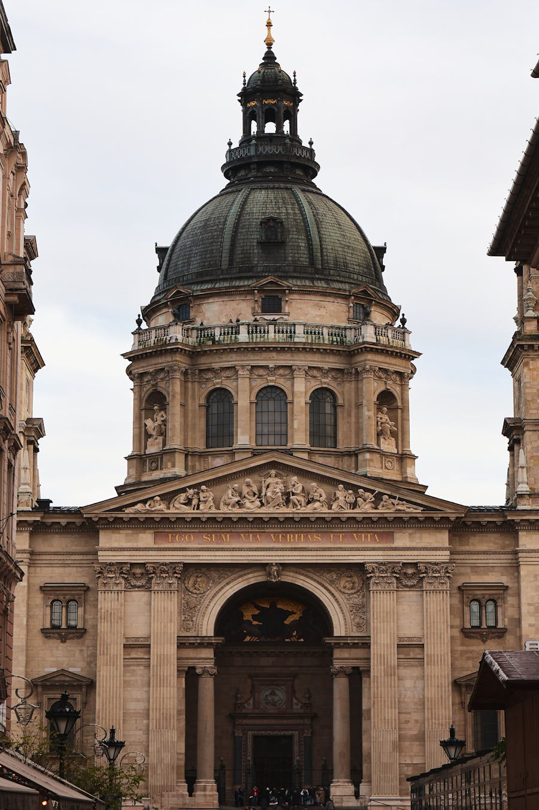

- **Address:** Id. Antall József rkp., 1054 Budapest
- **Map:** [Open in Google Maps](https://maps.google.com/?q=Shoes+on+the+Danube+Budapest)
- **Hours:** Always open, free
- **Tickets:** Free

Sixty pairs of cast-iron shoes on the embankment — memorial to Jews shot at the river's edge in 1944–45 by Arrow Cross militia, ordered to remove their shoes first. Quietly powerful, 10–15 min.

**Highlights & tips**
- Read the bronze plaque at the south end before walking the line.
- Walk south afterward to **Chain Bridge (Széchenyi lánchíd)** for photos — Budapest's oldest crossing, 1849, fully restored 2023. Don't cross — that's Day 3.

**Get there**
- M2 (red) → Kossuth Lajos tér, walk 5 min south. From Astoria: tram 47/49 → Astoria → walk to Deák, M2 → Kossuth Lajos tér.

**Nearest washroom**
- Free WC at **Hotel Marriott** lobby (Apáczai Csere János u. 4, south end of embankment). Order an espresso first if it feels awkward.

### 17:00 · St Stephen's Basilica + dome panorama

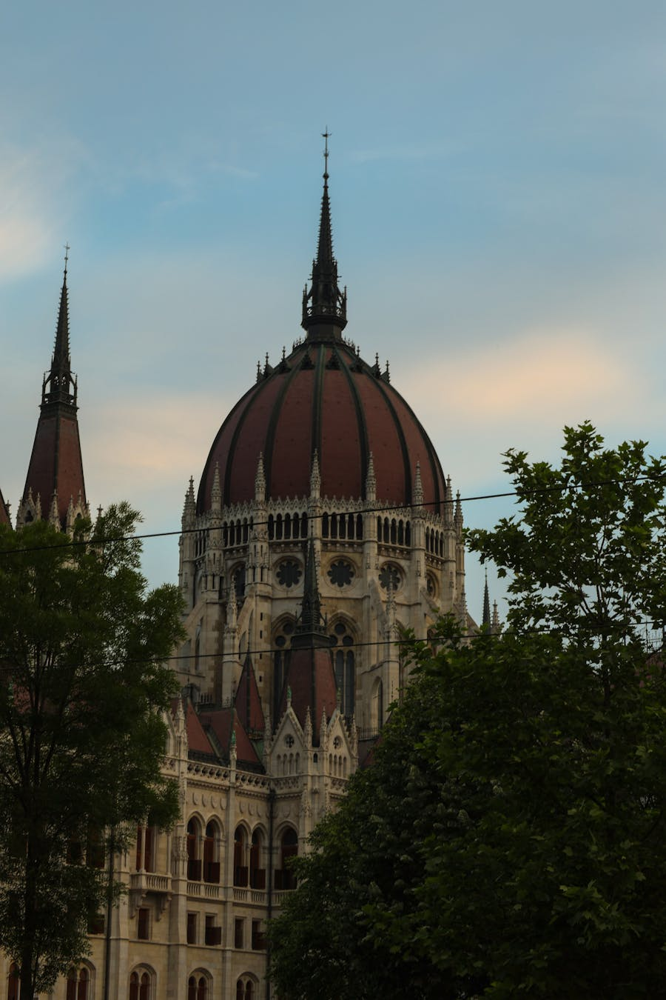

- **Address:** Szent István tér 1, 1051 Budapest
- **Map:** [Open in Google Maps](https://maps.google.com/?q=St+Stephens+Basilica+Budapest)
- **Hours:** Mon 09:00–16:30, Tue–Sat 09:00–17:45, Sun 13:00–17:45 (panorama lookout to 18:30 May)
- **Tickets:** Combined basilica + treasury + dome ~3,200 HUF at south-entrance ticket desk

Hungary's largest church, resting place of King Stephen's mummified right hand (the *Szent Jobb*). Climb 364 steps to the **panorama terrace** for the best free-with-ticket view of central Pest.

**Highlights & tips**
- Drop a 200 HUF coin in the box next to the *Szent Jobb* reliquary — lights up for 1 minute.
- Late-afternoon **organ concerts** (~6,000 HUF, ~1 h) — check posters in the lobby; if there's a 19:00 tonight you could swap the cruise.
- Café **Mihályi Patisserie** on the south side of Szent István tér — best crème brûlée in central Pest.

**Get there**
- 8-min walk north from Shoes on the Danube. Or M3 → Arany János utca.

**Nearest washroom**
- Paid WC (300 HUF) inside basilica off the south aisle. Free at **Erzsébet tér** ground-floor terminal.

### 18:30 · Walk Vörösmarty tér → Vigadó tér (cruise pier)

A 20-min stroll down central Pest. Window-shop Váci utca briefly (skip overpriced flag tat), pause at Café Gerbeaud's terrace, end at the **Vigadó tér Pier 6** to confirm cruise pickup.

### 20:30 · Legenda Sunset Cocktail Cruise

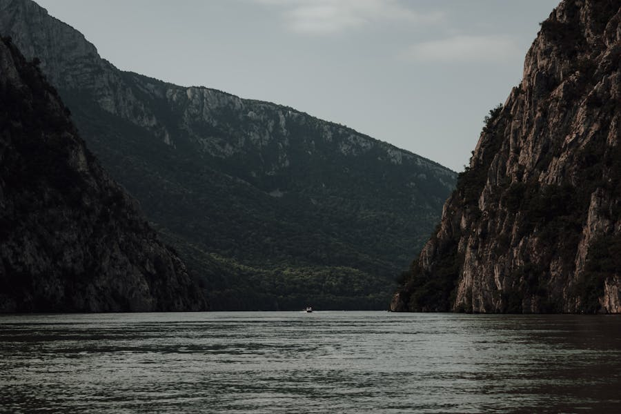

- **Address:** Vigadó tér Pier 6 (or Pier 7 Jane Haining rkp. — confirm on ticket)
- **Map:** [Open in Google Maps](https://maps.google.com/?q=Legenda+Cruise+Pier+Budapest)
- **Hours:** May sunset cruise departures 19:30 / 20:30 / 21:30 (1 h)
- **Tickets:** ~9,500 HUF including 1 cocktail at [legenda.hu](https://www.legenda.hu/) — book online for 10 % off

Locally-owned, real audio guide (28 languages), sails Margaret Bridge → Rákóczi Bridge loop. Parliament, Castle Hill, Liberty Statue, illuminated bridges in 60 min.

**Highlights & tips**
- **20:30 departure** in late May: board last daylight, end full illumination. 19:30 too early; 21:30 misses golden hour.
- Sit **upper deck, starboard side** outbound for Buda views; switch to port on return for Parliament finale.
- Bring a windbreaker — May river breeze is sharp.
- Avoid the cheap "Dinner Cruise" boats — playlist video #14 calls one out by name; food is microwaved.

**Get there**
- Tram 2 → Vigadó tér (one stop from Vörösmarty tér).

**Nearest washroom**
- Onboard (free, both decks).

**Late dinner** (post-cruise, 22:00+) — Astoria area is 15 min walk:
- **Mazel Tov** — Akácfa u. 47. Israeli-Hungarian, hummus + grilled chicken, courtyard, open till 02:00 Fri. Walk-in OK after 22:00.

---

## Day 2 — Saturday, May 23 — Parliament, Andrássy, Heroes Sq & Széchenyi Bath

The big timed-anchor day: Parliament tour at 09:00, then linear walk down Andrássy → Heroes Sq → City Park, ending with a 4-hour soak at Széchenyi. ~6 km on foot, restorative ending.

### 08:30 · Walk to Parliament

From Astoria: tram 2 north → Kossuth Lajos tér (15 min) or M2 → Kossuth Lajos tér (10 min). Be at Visitor Centre by 08:30 for security clearance.

### 09:00 · Hungarian Parliament Building (Országház) — booked tour

- **Address:** Kossuth Lajos tér 1-3, 1055 Budapest
- **Map:** [Open in Google Maps](https://maps.google.com/?q=Hungarian+Parliament+Building+Budapest)
- **Hours:** Daily 08:00–18:00 (last tour ~16:00)
- **Tickets:** ~10,000 HUF non-EU; **must book before arrival** at [jegymester.hu/parlament](https://www.jegymester.hu/parlament). Pick **09:00 or 09:30 English tour**.

Third-largest parliament in the world, 691 rooms, 88 statues, the Holy Crown of Hungary in the dome hall. 50-min interior tour walks the Grand Staircase, the 96-m central dome hall, the old Upper House.

**Highlights & tips**
- Watch **changing of the guard** outside the crown room (every hour on the hour).
- Best exterior photo from across the river at **Batthyány tér** — save for Day 3 sunset return.
- Tour is brisk; 50 min total.

**Nearest washroom**
- Free clean toilets inside Visitor Centre once past security with ticket.

### 10:30 · Walk to Andrássy avenue start

Walk 10 min south to Bajcsy-Zsilinszky → enter Andrássy út at #1.

### 11:00 · Andrássy Avenue walk (start → Oktogon)

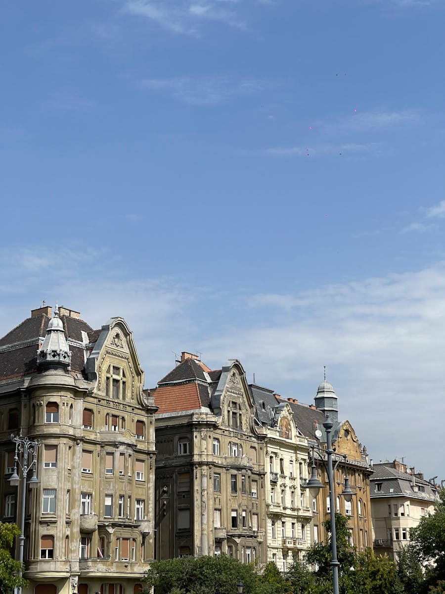

- **Map:** [Open in Google Maps](https://maps.google.com/?q=Andrassy+Avenue+Budapest)
- **Hours:** Always open
- **Tickets:** Free

UNESCO World Heritage axis, 2.3 km grand boulevard. Walk first half (~1.2 km) to Oktogon. Sat morning is quiet before noon.

**Highlights & tips**
- **Hungarian State Opera** (Andrássy út 22) — 45-min English tour 14:00 (~5,000 HUF) if you skip Heroes Sq detail. Reopened 2022 after restoration.
- **Művész Kávéház** (Andrássy út 29) — 1898 café, 3,500 HUF coffee + Dobos torte, calmer than New York Café.
- **House of Terror** (Andrássy út 60) — open Sat ~4,500 HUF, 1.5 h. Heavy. Audioguide essential. Skip if not in mood.
- **M1 metro** runs directly under the avenue — second-oldest underground in the world (1896), every station restored to original tile. Hop on at *Opera* or *Oktogon* if tired.

**Nearest washroom**
- Free WC inside Opera House lobby during box-office hours. Paid WC 300 HUF at Oktogon NE-corner kiosk.

### 12:30 · Lunch at Bock Bisztró or Klassz

- **Bock Bisztró** — Erzsébet krt. 43-49 (Hotel Corinthia, Oktogon). [Map](https://maps.google.com/?q=Bock+Bisztro+Budapest). 6,500 HUF napi menü with wine pairing; reserve.
- **Klassz** — Andrássy út 41. [Map](https://maps.google.com/?q=Klassz+Budapest). No-reservations Hungarian-modern; arrive 12:00 sharp Saturday or wait. ~5,500 HUF mains.

### 14:00 · M1 yellow line to Heroes Square

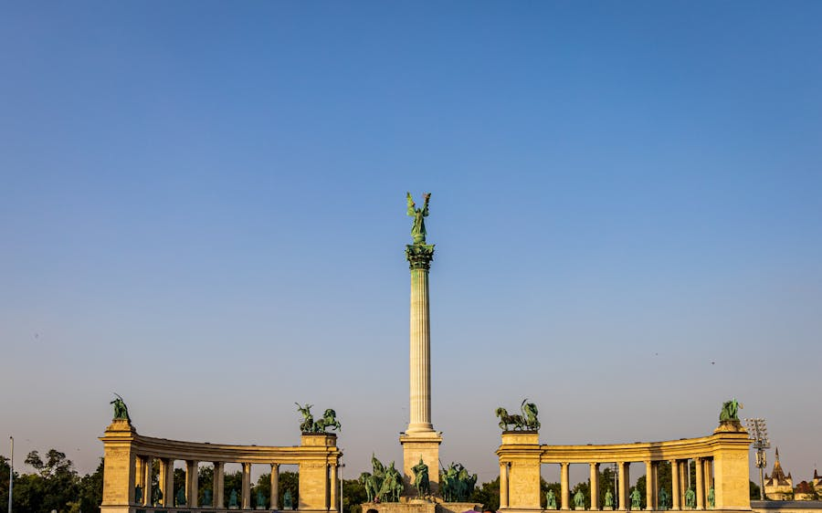

- **Address:** Hősök tere, 1146 Budapest
- **Map:** [Open in Google Maps](https://maps.google.com/?q=Heroes+Square+Budapest)
- **Hours:** Always open
- **Tickets:** Free outdoor monument

1896 Millennium Monument: Archangel Gabriel atop a 36-m column, flanked by Árpád and the seven Magyar chieftains. Two colonnades behind hold Hungarian kings + statesmen. Allow 25 min.

**Highlights & tips**
- Cross behind to **Vajdahunyad Castle** (10 min walk) — Disney-eclectic mash-up of Hungarian architecture around a small lake; free courtyards. Touch the **Anonymous statue's pen** for writer's luck.
- **Skip Museum of Fine Arts** today — keep momentum for House of Music + bath.

**Nearest washroom**
- Free WC at **Műcsarnok** lobby with ticket. Paid 300 HUF at Vajdahunyad café terrace.

### 15:00 · House of Music (Magyar Zene Háza)

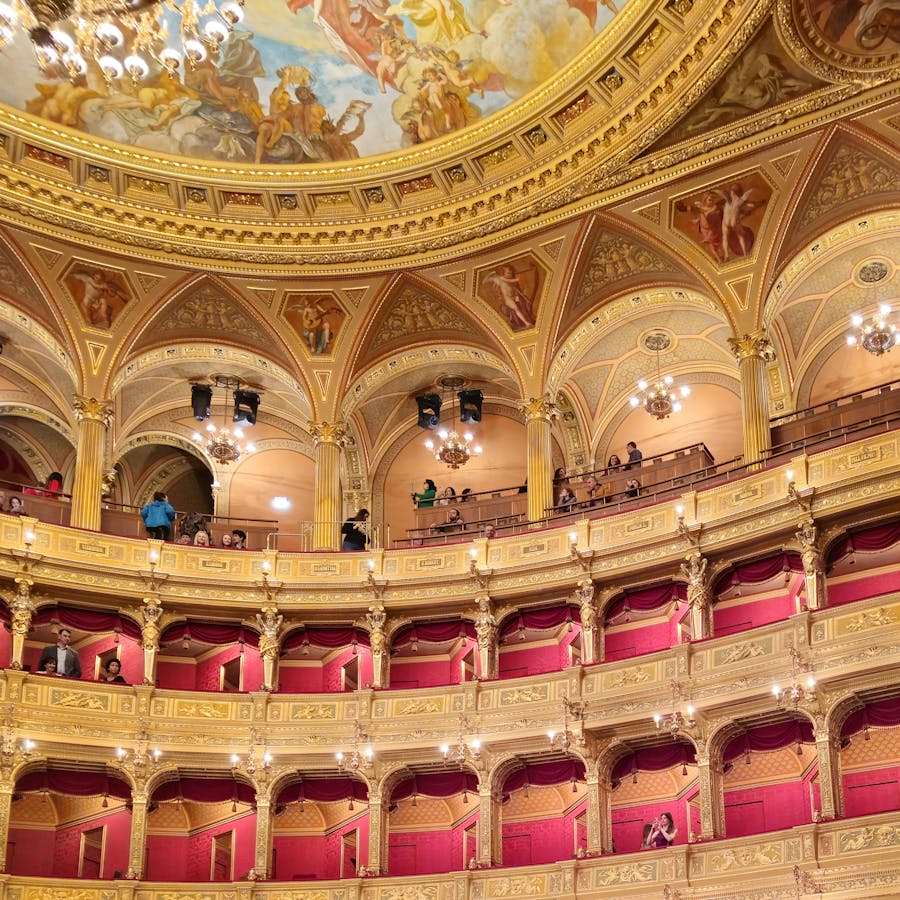

- **Address:** Olof Palme sétány 3-5, 1146 Budapest (5 min walk west of Heroes Sq)
- **Map:** [Open in Google Maps](https://maps.google.com/?q=Magyar+Zene+Haza+Budapest)
- **Hours:** Tue–Sun 10:00–18:00. **Closed Monday.**
- **Tickets:** Sound Dome only ~2,000 HUF; full exhibition ~4,000 HUF; [zenehaza.hu](https://zenehaza.hu/)

Sou Fujimoto's perforated golden roof building, opened 2022 — playlist's quirky-modern highlight. **Free Sound Dome** in the lobby is a 360° projection room, 12-min audio shows on rotation. Upstairs the **Sound Dimensions exhibition** uses location-aware binaural headphones.

**Highlights & tips**
- Don't take headphones off mid-room — audio resets.
- **Rooftop terrace** (free) has unobstructed City Park views.
- 1-hour visit is plenty unless music-nerd.

**Nearest washroom**
- Free WC inside (with ticket) — clean, generous.

### 16:30 · Széchenyi Thermal Bath

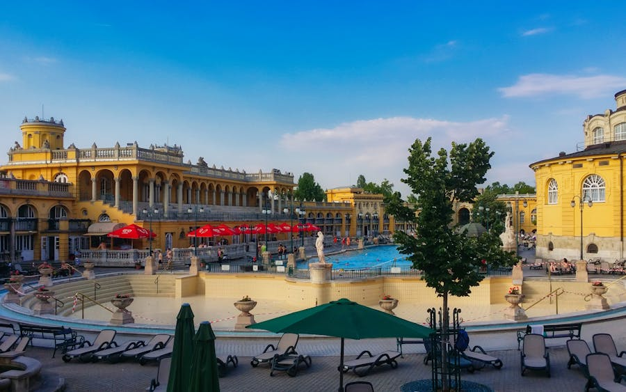

- **Address:** Állatkerti krt. 9-11, 1146 Budapest
- **Map:** [Open in Google Maps](https://maps.google.com/?q=Szechenyi+Thermal+Bath+Budapest)
- **Hours:** Daily 09:00–19:00 (last entry 18:00). Outdoor pools year-round.
- **Tickets:** Sat ~12,000 HUF with cabin, ~10,000 HUF locker. **Buy online at [szechenyibath.hu](https://www.szechenyibath.hu/)** — saves 30-min queue.

Europe's largest medicinal bath — neo-baroque yellow palace with 18 indoor + 3 outdoor pools, 76 °C thermal source. 2.5 hours is enough.

**Highlights & tips**
- **Bring own towel + flip-flops + swimsuit** — rentals 2,500 HUF each, slow.
- Outdoor pools rotation: 38 °C thermal (left) / 30 °C swimming centre (lap lanes; cap recommended) / 27 °C cool. 20-10-5 min cycle.
- **Indoor saunas** mostly mixed-gender swimsuit-required; calmest steam room behind pool 11.
- The famous chess-on-the-thermal-pool regulars finish ~17:00 — late afternoon you'll see the tail end.
- **Skip the Saturday-night Sparty** unless that's your scene.

**Nearest washroom**
- Inside the bath (free with ticket).

### 19:30 · Dinner — Robinson Restaurant or back to centre

- **Robinson Restaurant** — on Vajdahunyad's lake. [Map](https://maps.google.com/?q=Robinson+Restaurant+Budapest). 8,000 HUF mains, romantic terrace; reserve.
- Or M1 back to **Trattoria Pomo D'Oro** (Arany János u. 9) for non-Hungarian midweek. [Map](https://maps.google.com/?q=Pomo+d+Oro+Budapest). ~6,500 HUF; reserve.

---

## Day 3 — Sunday, May 24 — Buda Castle, Gellért Hill Sunset & Ruin Bars

The cross-the-river day. Morning Castle Hill (cobblestones — leave heels behind), late-afternoon panorama from Gellért Hill, evening ruin-bar crawl in your hotel's neighbourhood. ~7–9 km plus stairs.

### 09:00 · Walk to Castle Hill

From Astoria: M2 → Deák Ferenc tér → bus **16** → Dísz tér (drops 3 min walk from Matthias Church). Or walk over Chain Bridge + up Király lépcső stairs (25 min, romantic).

### 09:30 · Matthias Church + Fishermen's Bastion

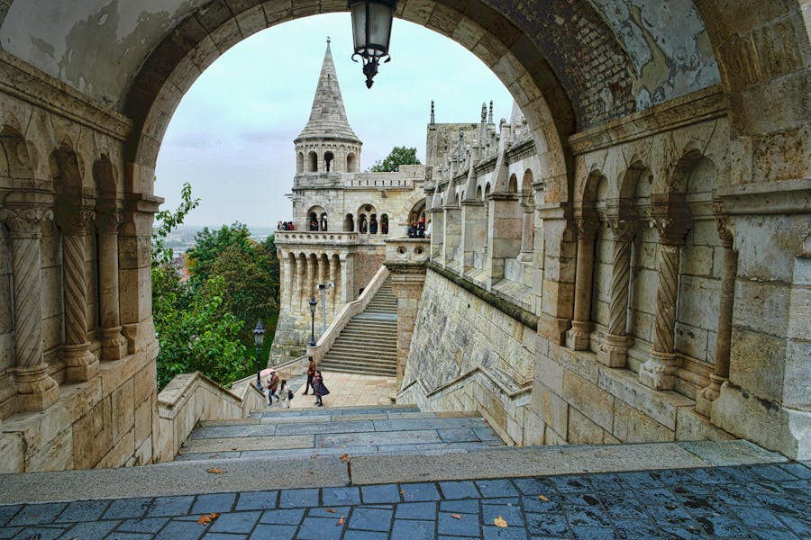

- **Address:** Szentháromság tér, 1014 Budapest
- **Map:** [Open in Google Maps](https://maps.google.com/?q=Fishermens+Bastion+Budapest)
- **Hours:** Bastion upper terraces 09:00–19:00; lower terraces always free. Matthias Church Sun 13:00–17:00 (closed during morning services — visit exterior + bastion first, return after lunch).
- **Tickets:** Bastion upper 1,800 HUF; Matthias Church 2,500 HUF (with tower).

Seven white turrets representing the seven Magyar tribes (895), ringed around 700-year-old Matthias Church. Free lower terrace = 95 % the same view as paid upper.

**Highlights & tips**
- **Empty before 09:30**, packed by 11:00 — go now.
- Skip paid upper terrace if budget is tight.
- Inside Matthias Church: painted walls + arabesque ceilings are Schulek's Art Nouveau over Gothic.

**Nearest washroom**
- Paid WC 300 HUF at Bastion's south-side café. Free in Matthias Church with ticket.

### 11:30 · Castle palace courtyards stroll

Walk south through Szentháromság tér → Tárnok u. → Dísz tér → Buda Castle palace courtyards. The Hungarian National Gallery is inside if mood strikes (3,500 HUF, 1.5 h) — but skip today; Hospital in the Rock is the booked anchor.

### 13:00 · Lunch in Castle district

- **Pierogi Pál** — Tárnok u. 3. [Map](https://maps.google.com/?q=Pierogi+Pal+Budapest). 4,500 HUF pierogi + house wine. No reservations.
- **Ruszwurm Cukrászda** — Szentháromság u. 7. [Map](https://maps.google.com/?q=Ruszwurm+Budapest). 200-year-old confectionery; krémes + coffee 2,500 HUF. Tiny room, long wait — get takeaway to a Bastion bench.

### 14:30 · Hospital in the Rock (Sziklakórház) — booked tour

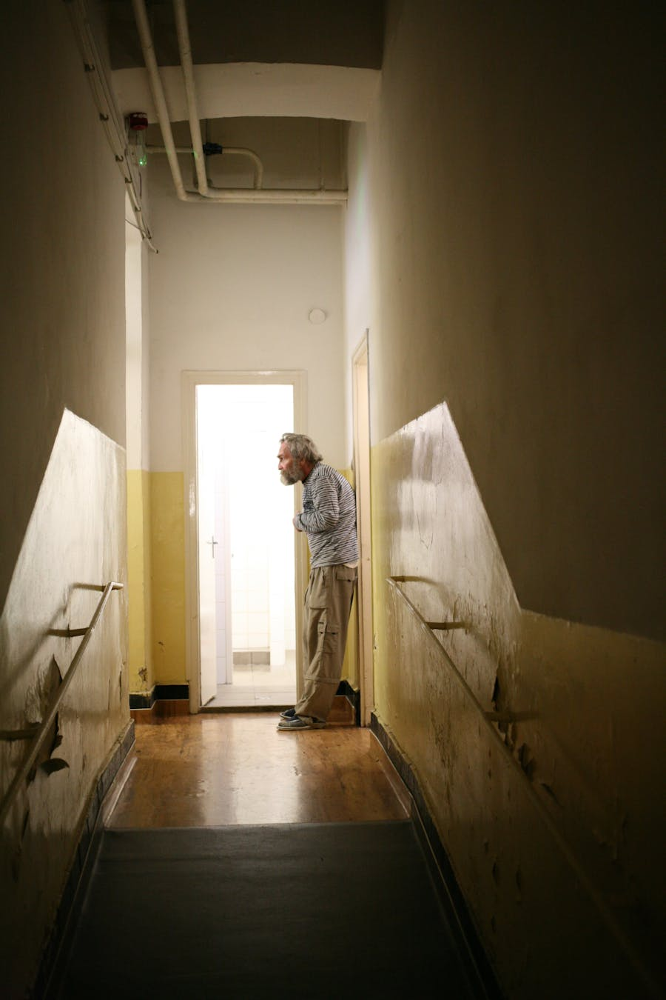

- **Address:** Lovas út 4/c, 1012 Budapest (5 min walk west of Matthias Church)
- **Map:** [Open in Google Maps](https://maps.google.com/?q=Hospital+in+the+Rock+Budapest)
- **Hours:** Daily 10:00–19:00; English tours every hour at :15
- **Tickets:** ~7,000 HUF; **book before arrival** at [sziklakorhaz.eu](https://www.sziklakorhaz.eu/) — sells out Sundays.

WWII underground hospital + Cold War bunker carved into Castle Hill caves. 1-hour mandatory tour walks 200 m of original wards with 70 wax figures showing surgeries, wounded soldiers, the 1956 Revolution. Phone-free (no photos). Sobering, well-paced.

**Highlights & tips**
- Bring a light layer — 14–17 °C year-round.
- Be there 15 min early — late = lose your slot, no refund.
- Skip the gas-mask souvenirs in the gift shop.

**Nearest washroom**
- Paid 200 HUF at entrance lobby. Free with ticket inside.

### 16:30 · Cross to Gellért Hill

Walk down to Clark Ádám tér (Chain Bridge Buda end), tram **19 or 41** along the river → *Szent Gellért tér*. Trail signed *Citadella*.

### 17:30 · Hike Gellért Hill to Citadella

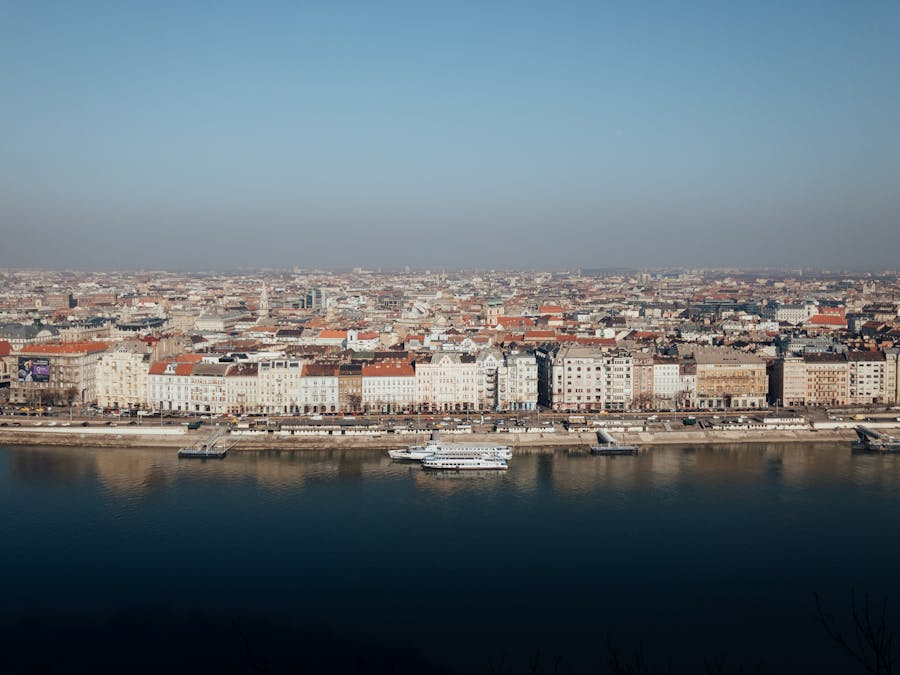

- **Address:** Citadella sétány, 1118 Budapest (top, 235 m)
- **Map:** [Open in Google Maps](https://maps.google.com/?q=Citadella+Budapest)
- **Hours:** 24/7 outdoors free. (Citadella fortress under restoration; Liberty Monument plaza open.)
- **Tickets:** Free

Best panorama in Budapest — Liberty Statue ("Lady Liberty with the palm leaf") looks east over a 270° sweep: Pest skyline, Danube curve, Castle Hill behind.

**Highlights & tips**
- **Late May sunset 20:30.** Start hike from Buda foot of Erzsébet híd at **19:15**; allow 25–30 min up. Path passes Philosophers' Garden + Gellért Statue waterfall.
- Bring a small picnic + bottle of wine — only a coffee kiosk on top (closes 20:00).
- **Descend east** toward Szabadság híd (Liberty Bridge) for golden-hour photos with Citadella behind. Walk Liberty Bridge into Pest for night photos of green ironwork.

**Nearest washroom**
- Paid 300 HUF at Citadella plateau kiosk (closes 20:00). Free at Hotel Gellért lobby.

### 21:00 · Dinner + Jewish Quarter ruin bar crawl

Cross Liberty Bridge → tram 47/49 north → **Astoria** (your home base). The ruin bars are 5–10 min walk from Astoria.

- **21:00 — Karaván Street Food** (Kazinczy u. 18) — start with lángos + craft beer in food-truck courtyard. 11:30–02:00.
- **22:00 — Szimpla Kert** (Kazinczy u. 14) — original ruin bar (2002). Walk every floor; **upstairs cinema room with bathtub seats** is the playlist favourite. Sun is calmer than Sat.
- **23:30 — Doblo Wine Bar** (Dob u. 20) — candle-lit, 70 Hungarian wines by the glass. Try **Tokaji Furmint** flight or **Eger Bikavér**.
- **00:30 — Mazel Tov** (Akácfa u. 47) — late hummus + grilled chicken if hungry, courtyard, open till 02:00 Sun.

Skip **Instant–Fogas** unless you specifically want a giant club — playlist video #35 flags it as touristy.

**Get home:** All within 10 min walk of Astoria.

---

## Day 4 — Monday, May 25 — Central Market, Palace District (your block!), Margaret Island & Tram 2

Mon = museum closures (House of Terror, House of Music, Hungarian National Museum, Museum of Fine Arts all closed). Plan stays outdoor + market + neighbourhood. **Bonus**: your hotel is *in* the Palace District — exploring by foot from the doorstep. ~5 km, light pace.

### 09:30 · Central Market Hall (Nagyvásárcsarnok)

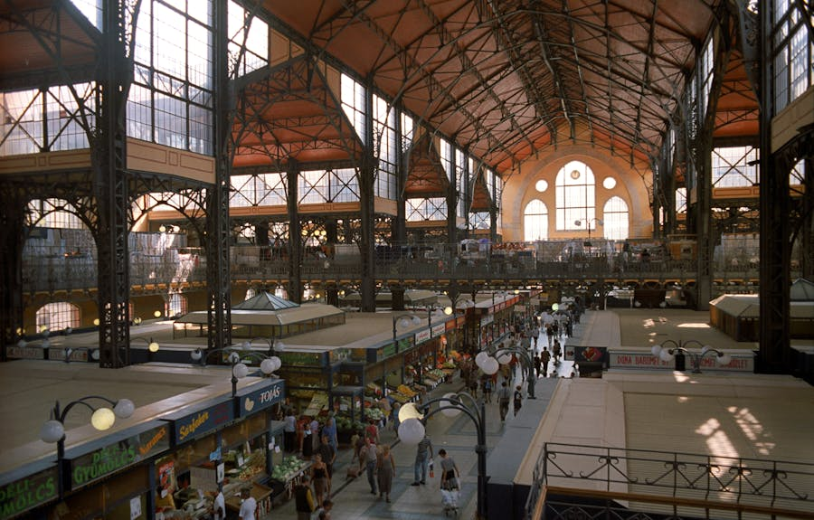

- **Address:** Vámház krt. 1-3, 1093 Budapest (15 min walk south from Astoria via Múzeum krt → Kálvin tér)
- **Map:** [Open in Google Maps](https://maps.google.com/?q=Central+Market+Hall+Budapest)
- **Hours:** Mon 06:00–17:00, Tue–Fri 06:00–18:00, Sat 06:00–15:00. **Closed Sun.**
- **Tickets:** Free entry; cash + card both work

Built 1897, restored 1990s. Three levels — fresh produce + paprika + salami ground floor; upstairs lángos counters + souvenir gallery. Mon mid-morning is calm tourist window.

**Highlights & tips**
- **Buy Édesnemes paprika tin** at any ground-floor stall (1,800 HUF) — same quality as airport tat for one-third price.
- **Upstairs lángos:** **Lángos Király** in south corner, 1,800 HUF garlic-cheese-sour-cream classic.
- **Skip** imported truffles, saffron, pre-packed goulash mixes upstairs — overpriced.
- **Tokaji wine stall** ground floor west wall — 2,500 HUF half-bottle Aszú 5 puttonyos for souvenir.
- **Salami stalls** vacuum-pack on request — flight-friendly.

**Nearest washroom**
- Paid 300 HUF at entrance. Free with order at upstairs **Fakanál Étterem** (4,500 HUF goulash buffet lunch).

### 11:00 · Palace District (Józsefváros) walk

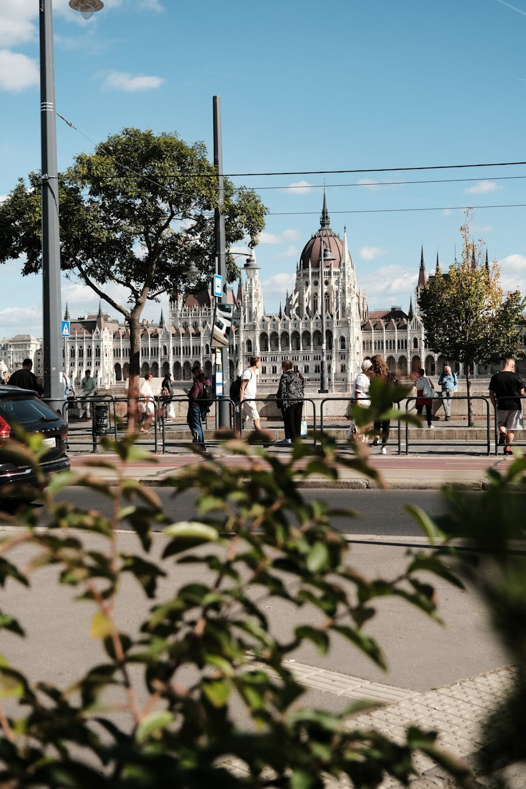

- **Start:** Kálvin tér → walk east via Múzeum krt → Bródy Sándor u → Mikszáth Kálmán tér
- **Map:** [Open in Google Maps](https://maps.google.com/?q=Palace+District+Budapest)
- **Hours:** Always open
- **Tickets:** Free

**Your hotel's neighbourhood** — Budapest's least-touristed central district. 19th-c aristocrat palaces, the Hungarian National Museum (closed Mon — exterior only today), restored cafés. Playlist video #25 calls it "the Budapest most tourists never see".

**Highlights & tips**
- Walk **Bródy Sándor utca** for architectural detail — pause at #4 (Italian Cultural Institute, ex-House of Representatives), #8 (atrium with skylights, peek in if open), #16 (Hungarian Radio HQ where 1956 Revolution started — bullet holes still visible on the facade).
- **Hungarian National Museum exterior** (Múzeum krt. 14-16) — Petőfi recited "Nemzeti Dal" on these steps in 1848. Closed Mon but the steps and gardens are open.
- **Mikszáth Kálmán tér** is the local hangout square — cafés on every corner.
- **Café Csiga** (Vásár u. 2) — bohemian neighbourhood spot, 2,500 HUF coffee + sandwich.

**Nearest washroom**
- Café Csiga or any Mikszáth tér café (with order). Free outside option: paid 200 HUF at Astoria metro.

### 12:30 · Lunch — Stand by Me or Stand 25

- **Stand by Me** — Bródy Sándor u. 19. [Map](https://maps.google.com/?q=Stand+by+Me+Budapest). Modern Hungarian, ~6,500 HUF napi menü with wine pairing; reserve.
- **Stand25 Bisztró** — Hold u. 13 (15 min walk north, inside Hold utcai Piac). Small, Michelin-Bib-Gourmand, 5,500 HUF; reserve.

### 14:30 · Kolodko mini-statue hunt + hidden courtyards

A treasure-hunt walk for **Mihály Kolodko's** miniature bronze statues — 30+ across central Pest, each 10–20 cm, tucked into railings + walls + stair edges. Free, surprising photos.

Easiest five-statue loop (playlist video #13):

1. **Vekker (alarm clock)** — Astoria, NW corner of square, on metal post — **literally outside your hotel**, start here
2. **Rubik's Cube** — Rumbach Sebestyén u., wedged in a recess (5 min walk north)
3. **Ducklings of Klauzál tér** — Klauzál tér south corner, on iron grate (5 min more)
4. **Falk Miksa Columbo** — Falk Miksa u. (corner of Markó), detective with cigar leaning on railing (15 min walk + tram 2)
5. **Tank-from-Mazsola** — opposite Parliament south side, on Báthory u. railing (5 min from #4)

**Highlights & tips**
- Use [kolodko.hu](https://kolodko.hu/) **interactive map** for all 30+.
- Mini-statues easy to miss — slow down at each location, look at chest-height railings.
- Combine with **hidden courtyards** (playlist video #19): **Párisi Udvar** (Petőfi Sándor u. 2) — restored 1909 Art Nouveau arcade, free walk-through; **Anker köz** between Anker köz and Deák Ferenc utca — graffiti cut-throughs; **Brody Studios** (Bródy Sándor u. 10) — peek inside the courtyard.

**Nearest washroom**
- Paid 200 HUF at Astoria metro. Free at **Párisi Udvar Hotel lobby** with a coffee at *Brasserie & Atelier* (~2,500 HUF).

### 17:00 · Tram 2 — the world's most scenic tramline

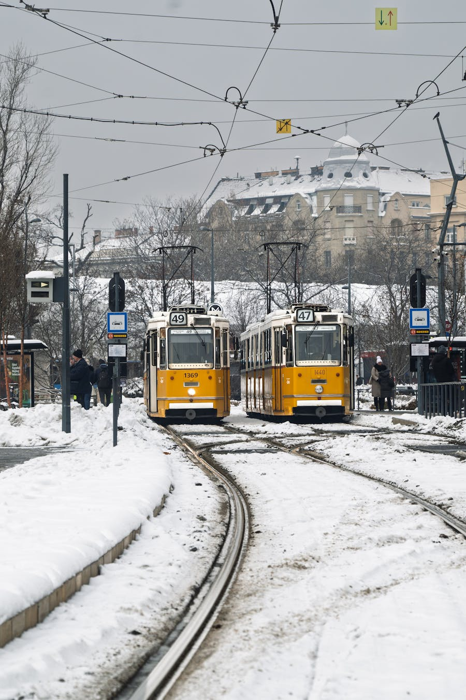

- **Boarding:** Jászai Mari tér (north) or Közvágóhíd (south)
- **Map:** [Open in Google Maps](https://maps.google.com/?q=Tram+2+Vigado+ter+Budapest)
- **Hours:** Every 7–10 min, 04:30–23:30
- **Tickets:** Covered by your travelcard

National Geographic ranked Tram 2 among the world's seven most scenic tramlines. Runs the entire Pest Danube embankment — Margaret Bridge → Parliament → Vigadó → Erzsébet Bridge → Liberty Bridge.

**Highlights & tips**
- **Board at Jászai Mari tér** (north end), ride south at **17:30–18:00** for early-evening light. Sit **right side facing south** = Castle Hill side.
- 35-min ride, ~6 km. Hop off any of 12 stops. Vigadó tér = best Chain Bridge photo.

**Get there**
- M3 → Nyugati pályaudvar, walk 5 min west to Jászai Mari tér.

### 18:30 · Margaret Island bike loop + Musical Fountain

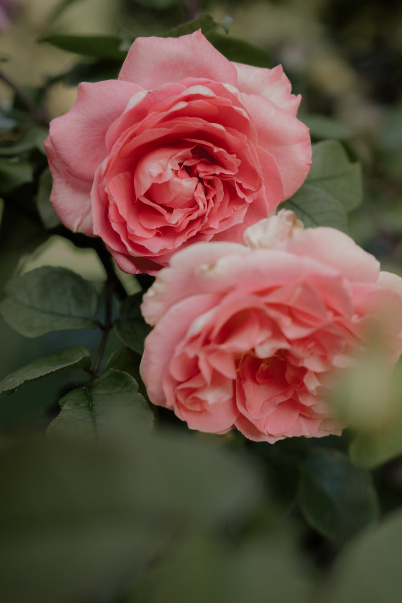

- **Address:** Margitsziget, 1138 Budapest (between Margit híd and Árpád híd)
- **Map:** [Open in Google Maps](https://maps.google.com/?q=Margaret+Island+Budapest)
- **Hours:** Always open; Musical Fountain hourly 10:00–22:30 May
- **Tickets:** Free island; bike rental ~3,500 HUF / 2 h or **Bringóhintó** 4-person pedal-cart 6,000 HUF / h at south entrance.

2.5-km park island — rose garden (peak bloom late May!), Japanese garden, Roman convent ruins, Musical Fountain dancing to classical/pop on the hour.

**Highlights & tips**
- Rent a bike at south entrance, ride **flat 5.3-km perimeter loop** in ~30 min (car-free), then walk the rose garden.
- Time **Musical Fountain at 19:00 or 20:00** — bring a beer from the kiosk, sit on south fountain steps.
- **St Margaret's Convent ruins** in the centre — chapel with original 13th-c stones, free.
- Skip the small zoo (depressing).

**Get there**
- After Tram 2, hop off at *Jászai Mari tér* and walk across Margit híd onto the island. Or tram 4/6 → *Margitsziget*.

**Nearest washroom**
- Paid 200 HUF at south-entrance bike kiosk + Musical Fountain.

### 21:00 · Dinner near Astoria — Köleves or Babka

- **Köleves Vendéglő** — Kazinczy u. 35. [Map](https://maps.google.com/?q=Koleves+Budapest). Bistro classics in colourful courtyard; ~5,000 HUF; book.
- **Babka** — Klauzál tér 7. [Map](https://maps.google.com/?q=Babka+Budapest). Israeli-Hungarian crossover; ~5,500 HUF; book.

Early to bed — Szentendre HÉV tomorrow.

---

## Day 5 — Tuesday, May 26 — Szentendre Full Day Trip + Farewell Dinner

A baroque artist village 21 km north of Budapest on a Danube curve, founded by Serbian refugees in the 17th century. 40-min HÉV ride — feels like a different country. Closed-Mon museums in Szentendre are open Tue. **This is your last day** — be back by 19:00, dinner at 20:00, packed by 22:00, sleep early.

### 08:30 · Walk / metro to Batthyány tér

From Astoria: M2 (red) → **Batthyány tér** (3 stops, 8 min). Same platform handles the **HÉV H5** suburban line.

**Buy HÉV supplement** at any kiosk on the platform: **750 HUF each way** (Budapest zone end is at Békásmegyer; Szentendre is past it). Without supplement = 16,000 HUF inspector fine.

### 09:00 · HÉV H5 → Szentendre

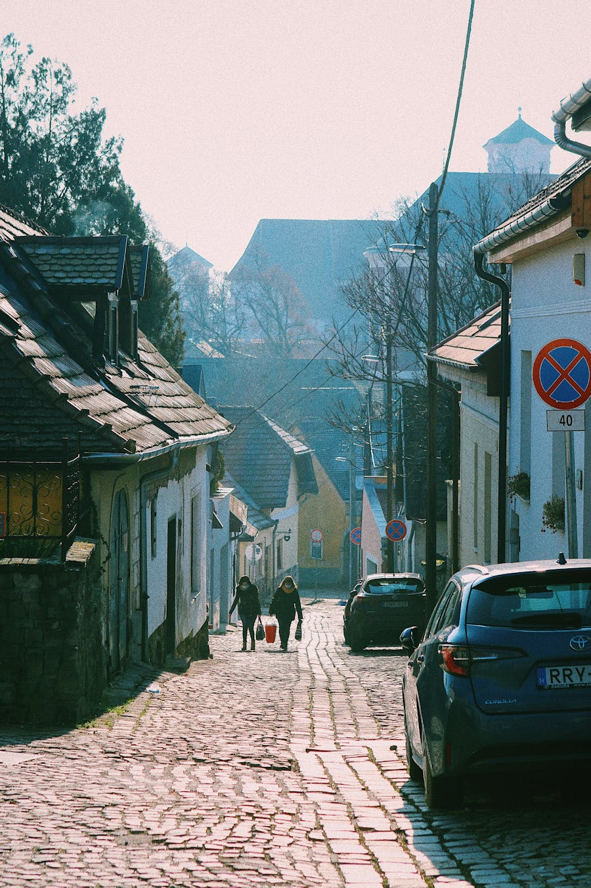

- **HÉV H5 line, terminus = Szentendre**
- Trains every 10–20 min from 04:30–23:30
- 40-min ride

Sit on the **right side** for Danube views from km 25 onward.

### 09:40 · Arrive Szentendre HÉV station

Walk north on **Kossuth Lajos u.** for 8 min → reach **Dumtsa Jenő utca** → enter the old town. Free public WC at **TourInform** office on Dumtsa Jenő u.

### 09:50 · Szabó Marcipán Museum (optional, 20 min)

- **Address:** Dumtsa Jenő u. 14
- **Map:** [Open in Google Maps](https://maps.google.com/?q=Szabo+Marzipan+Museum+Szentendre)
- **Hours:** Daily 10:00–18:00
- **Tickets:** ~600 HUF

Kitsch but fun — life-size marzipan Michael Jackson, 160-piece edible Hungarian Parliament, Snow White. 20 min, the kids' favourite + your IG joke. Skip if not into camp; main square is the destination.

### 10:30 · Fő tér (Main Square) + Plague Cross

- **Address:** Fő tér, 2000 Szentendre
- **Map:** [Open in Google Maps](https://maps.google.com/?q=Fo+ter+Szentendre)
- **Hours:** Always open
- **Tickets:** Free

The baroque postcard centre — pastel houses around an irregular cobblestoned square, the **Plague Cross (Pestiskereszt)** in the middle (1763, marking the end of an outbreak). Coffee terraces around the edge.

**Highlights & tips**
- Photograph the square's south-east corner — the famous yellow-facade row.
- **Görög utca** runs east off the square — start of the gallery + boutique strip.
- Pause at **Café Edeni** (Fő tér 8) for an espresso + Dobos torte (~2,200 HUF) and people-watch.

### 11:00 · Blagovestenska Serbian Orthodox Church

- **Address:** Fő tér 5 (south-east corner of square)
- **Map:** [Open in Google Maps](https://maps.google.com/?q=Blagovestenska+Church+Szentendre)
- **Hours:** Tue–Sun 10:00–17:00
- **Tickets:** ~600 HUF

1754 Serbian Orthodox church, painted iconostasis behind a baroque facade — the legacy of the 17th-c Serbian refugee community who fled the Ottomans. Quietly beautiful, 20 min.

**Highlights & tips**
- Cover shoulders + knees (a wrap is provided at door).
- Look for the gilded iconostasis — gold leaf restored 2010s.
- The handwritten Serbian-Cyrillic plaques are the originals.

### 11:30 · Climb Templom-domb (Church Hill) for the panorama

- **Address:** Templom-domb (signed up Bogdányi út → Alkotmány u. → stairs)
- **Map:** [Open in Google Maps](https://maps.google.com/?q=Templom+domb+Szentendre)
- **Hours:** Always open
- **Tickets:** Free

Szentendre's **best free panorama** — climb 5 min up cobbled stairs from the north side of Fő tér. The hilltop holds the **Catholic Parish Church** (Plébánia-templom, 13th-c, oldest building in town) and a viewing terrace looking down over the red-tiled rooftops + Danube.

**Highlights & tips**
- The terrace photo from the **west wall** captures the famous Szentendre roofscape.
- Inside the church (entry free during open hours): medieval stone fragments behind the altar.
- A small **art market** sets up around the church on Tue–Sun warm days.

**Nearest washroom**
- None on the hill — go before climbing. Café Edeni on Fő tér is the nearest.

### 12:15 · Belgrád Serbian Orthodox Cathedral + Museum

- **Address:** Pátriárka u. 5, 2000 Szentendre (5 min walk north of Templom-domb)
- **Map:** [Open in Google Maps](https://maps.google.com/?q=Belgrade+Serbian+Cathedral+Szentendre)
- **Hours:** Tue–Sun 10:00–17:00
- **Tickets:** Cathedral + museum combined ~1,500 HUF

The seat of the **Serbian Orthodox Bishop of Buda** since 1690 — modest exterior, dazzling 18th-c iconostasis inside. The adjoining **Museum of Serbian Ecclesiastical Art** holds illuminated manuscripts, vestments, and silver liturgical objects. 30 min combined.

**Highlights & tips**
- Quieter than Blagovestenska, fewer tourists.
- The **bell tower courtyard** has small wildflower garden — good photo spot.
- If short on time, do the cathedral and skip the museum.

### 13:00 · Lunch — Lánchíd Söröző (riverside)

- **Address:** Bogdányi út 1, 2000 Szentendre (riverside, 5 min walk east)
- **Map:** [Open in Google Maps](https://maps.google.com/?q=Lanchid+Sorozo+Szentendre)
- **Hours:** Daily 11:00–22:00
- **Reservation:** Recommended Tue lunch — call +36 26 313 660 or walk in by 12:45

Locals' lunch spot on the Danube embankment. Their **grilled trout (pisztráng)** is the signature — 4,500 HUF, served whole with lemon-butter potatoes. Goulash + bread 3,200 HUF; fisherman's soup (halászlé) 3,800 HUF. Garden seating with river view.

**Alternatives:**
- **Aranysárkány Vendéglő** — Alkotmány u. 1/A. Old-school Hungarian, ~5,500 HUF, terrace. Reserve.
- **Promenade Restaurant** — Futó u. 4. Modern Hungarian, ~6,500 HUF, water view.
- **Palapa** — Dumtsa Jenő u. 22. Mexican/Tex-Mex if Hungarian fatigue sets in, 4,000 HUF.

**Nearest washroom**
- Free at Lánchíd Söröző (with order).

### 14:30 · Kovács Margit Ceramic Museum

- **Address:** Vastagh György u. 1, 2000 Szentendre (5 min walk back from riverside)
- **Map:** [Open in Google Maps](https://maps.google.com/?q=Kovacs+Margit+Museum+Szentendre)
- **Hours:** Tue–Sun 10:00–18:00. **Closed Monday.**
- **Tickets:** ~2,400 HUF

Hungary's most famous female ceramic artist (1902–1977). The museum holds 300+ of her works in an 18th-c salt-storage building — Hungarian folk life, biblical scenes, female figures with distinctive elongated forms. 1 hour, very photogenic, the playlist video #33 calls it Szentendre's must-do indoor stop.

**Highlights & tips**
- Audio guide (free with ticket) is worth it — Margit's life story explains the art.
- **The gift shop** here is the one place to buy genuine artisan ceramics in Szentendre — most Fő tér stall ceramics are mass-produced.
- The cellar level has her early experimental pieces.

**Nearest washroom**
- Free with ticket inside.

### 15:45 · Riverbank promenade + Görög utca galleries

A slow walk to wind down — head back to **Bogdányi út** and walk **north along the Danube embankment** (less touristed than Fő tér), pause in any of the 25+ tiny galleries on **Görög utca** + **Bogdányi út**.

Worth pausing at:
- **Czóbel Béla Museum** — Templom-domb area. Hungarian-French modernist, 1,800 HUF, 30 min if interested.
- **Ferenczy Múzeum** — Kossuth Lajos u. 5. Local-art rotating exhibits, 2,000 HUF.
- **Szamos Marzipan Café** — Dumtsa Jenő u. 12. Better than Szabó's marzipan to actually eat (chocolate-marzipan slice 1,800 HUF).
- **Görög utca galleries** — pop into any with open doors. Painted-egg shops sell mass-produced; **artisan eggs** are at the Kovács Margit gift shop.

**Skip:**
- **Skanzen Hungarian Open-Air Ethnographic Museum** — 5 km outside town on bus 230, ~3-hour visit. Excellent but **eats your day** — leave for a return trip. Today's plan stays in town.

### 17:00 · Coffee + krémes farewell

- **Café Edeni** (Fő tér 8) for one more square-side coffee + **krémes** before HÉV.

### 17:30 · Walk to HÉV station

8-min walk south on Kossuth Lajos u. → station.

### 17:45 · HÉV H5 → Batthyány tér

Boards back to Budapest — arrive **18:25** Batthyány tér.

### 19:00 · Hotel — pack + freshen up

You return Wed 03:30 — pack tonight, set 03:00 alarm, confirm taxi (Bolt or hotel reception, 6,500–8,500 HUF to BUD, 30-min ride).

### 20:00 · Farewell dinner

Two memorable picks (reserve **2+ weeks ahead**):

- **Borkonyha Winekitchen** — Sas u. 3 (1 Michelin star, central Pest, 15-min walk from Astoria). [Map](https://maps.google.com/?q=Borkonyha+Budapest). 18,000 HUF tasting; ~9,500 HUF à la carte. Wine-focused.
- **Halászbástya Étterem** — inside Fishermen's Bastion. [Map](https://maps.google.com/?q=Halaszbastya+Etterem+Budapest). 12,000–18,000 HUF tasting menu; **request terrace seating Pest-side**. The taxi back to Astoria is 4,500 HUF — easy.

Quieter alternative if budget is spent:
- **Stika** — Dob u. 46 (5 min from Astoria). [Map](https://maps.google.com/?q=Stika+Budapest). Modern small-plates bistro, ~7,500 HUF, walk-in OK Tue.

Walk Liberty Bridge or take a last spin on Tram 2 if there's energy left, but **be in bed by 23:00** — wakeup is 03:00.

---

## Departure — Wednesday, May 27 — Early flight AC 9023

- **03:00** alarm
- **03:15** final pack, water bottle empty (refill airside)
- **03:30** taxi to **BUD Terminal 2A** (~30 min, ~7,000 HUF; pre-book Bolt night before — surge pricing real)
- **04:00** check-in opens — Lufthansa-operated AC 9023 desk
- **05:00** through security + passport (non-Schengen UK/CA passports are routine here; queue typically <15 min at this hour)
- **05:25** boarding
- **05:55** wheels up → FRA 07:40 → AC layover 2.5 h → YVR

**Important:**
- **100E airport bus does not run before 04:00** — first bus 04:00 from Deák, 30 min ride, would put you at terminal ~05:00 = too late. **Taxi is the only safe option.**
- **Kerítés kút** (free water-fountain) is at gate area airside in 2A — refill there, not landside.

---

## Quick links

- [food.md](food.md) — must-try dishes + where to eat
- [phrasebook.md](phrasebook.md) — 60 essential phrases with phonetics
- [washrooms.md](washrooms.md) — paid vs free WC route reference

**Sources:** built from the playlist [Budapest / Hungary Travel Guide (Local YouTube channel)](https://youtube.com/playlist?list=PLtV2zB28YXqiyU5iLzzXJNNWn_VRhDrIl). Verify hours + prices on official sites before going — Hungary mid-inflation, ticket prices shift every 6 months.
