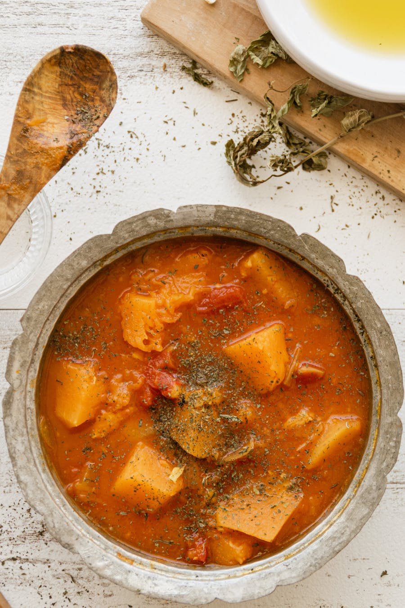
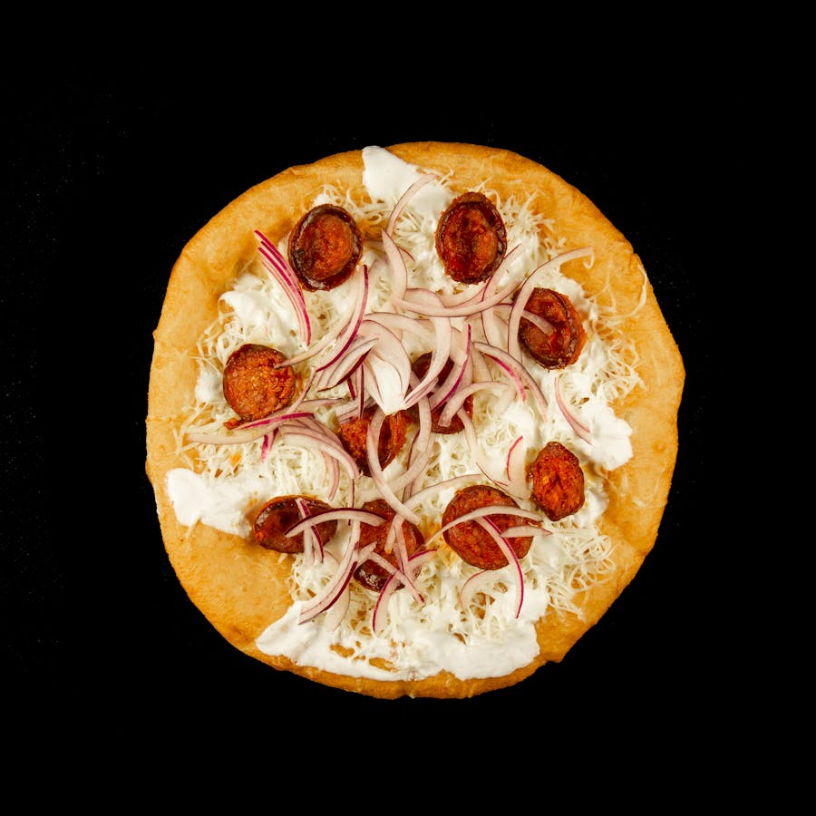

# Budapest Food Guide

A pocket reference to Hungarian food: what to order, where the playlist sends locals, and what to skip.

Back to [itinerary](Budapest_5_Day_Itinerary.md).

## Hungarian cuisine in 60 seconds

Hungarian cooking is **paprika-forward, lard-rich, slow-cooked, river-and-plain food** — heavily influenced by Ottoman, Austrian, and Jewish kitchens. Soups are a course of their own (rarely skipped), bread is on every table, and the main hot meal is **lunch**, not dinner. Coffeehouse culture matters: a 1900-era café (`kávéház`) is a Hungarian institution, not a Starbucks substitute.

A typical meal:
1. **Soup** — gulyás, halászlé, or jókai bableves
2. **Main** — paprikás csirke, töltött káposzta, or pörkölt
3. **Side** — galuska (small dumplings) or nokedli, sometimes potatoes
4. **Dessert** — somlói galuska, Dobos torte, or palacsinta
5. **Coffee** — short, strong, no milk unless asked

## Must-try dishes

### Goulash (Gulyás)

**It's a soup, not a stew.** Real Hungarian gulyás is a brothy paprika-and-beef soup with potato and small dumplings (`csipetke`). The thick "stew with gravy" served abroad is **pörkölt** — also good but a different dish.

- **Where:** **Gettó Gulyás** (Wesselényi u. 18) — playlist's #1 for traditional bowl, 3,500 HUF; reserve. **Hungarikum Bisztró** (near Parliament) — tourist-leaning but good. **Café Kör** (Sas u. 17) — old-school Pest, beef gulyás 3,800 HUF.
- **Skip:** the giant cauldron pots in Váci utca tourist restaurants — usually thin and over-spiced.

### Chicken Paprikash (Paprikás Csirke)

Chicken simmered in paprika, onion, and sour-cream sauce, served over `nokedli` (small egg dumplings). Comfort food, 4,500–5,500 HUF.

- **Where:** **Spinoza Café** (Dob u. 15), **Belvárosi Disznótoros** (counter-style 2,500 HUF), **Rosenstein** (Mosonyi u. 3) — the best, Jewish-Hungarian, reserve a week ahead.

### Lángos

Deep-fried flatbread the size of a frisbee, classically topped with garlic oil + sour cream + grated cheese. Street food, 1,500–2,500 HUF.

- **Where:** **Retro Lángos** at Karaván (Kazinczy u. 18), **Lángos Király** at Central Market upstairs, **Tűzőr Étterem** (more rustic, Erzsébetváros).
- **Order tip:** Ask for it `fokhagymás-tejfölös-sajtos` (garlic-sourcream-cheese). Skip the Nutella version unless dessert mood.

### Stuffed Cabbage (Töltött Káposzta)

Sour cabbage leaves wrapped around minced pork + rice, stewed in paprika tomato sauce, topped with sour cream. 3,500–4,500 HUF.

- **Where:** **Frici Papa** (Király u. 55) — diner-style, 3,200 HUF, no reservations.

### Hungarian Sausage (Kolbász) Tasting

A market-hall standing experience. Three types worth knowing:
- **Csabai** — paprika-spicy, smoked, from Békéscsaba
- **Gyulai** — milder, garlicky
- **Téliszalámi** — the famous winter salami, dry-aged, slice-thin

- **Where:** Central Market Hall (ground floor north stalls). 2,000–3,000 HUF for a tasting plate.

### Fisherman's Soup (Halászlé)

A fiery red paprika fish soup, traditionally with carp or catfish from the Danube/Tisza. 3,500–4,500 HUF.

- **Where:** **Halászbástya Étterem** does an upscale version; **Halkakas Halbisztró** (Veres Pálné u. 17) — cheaper and excellent, 3,800 HUF.

### Kürtőskalács (Chimney Cake)

Sweet dough rolled around a wooden spit, baked over open coals, dusted in cinnamon-sugar/walnut/coconut. 1,500–2,500 HUF.

- **Where:** **Vitéz Kürtős** (Váci u. & Karaván) — playlist's preferred. Avoid Fő utca / Castle Hill stands which charge double.

### Dobos Torte

A 7-layer sponge cake with chocolate buttercream and a caramel-shellac top, invented in 1885 by József Dobos. Hungary's national cake.

- **Where:** **Auguszt Cukrászda** (Kossuth Lajos u. 14) — playlist favourite for cream-cake showdown. **Gerbeaud** (Vörösmarty tér 7) — touristy but the original recipe. **Művész Kávéház** (Andrássy út 29) — reasonable price + view of the Opera.

### Somlói Galuska

Three-flavoured sponge cake (vanilla, walnut, chocolate) with rum, raisins, and whipped cream. 1,800–2,500 HUF.

- **Where:** **Auguszt**, **Café Csiga**, almost any Hungarian restaurant offering dessert.

### Krémes (Cream Slice)

Vanilla-cream-stuffed puff pastry. The playlist's "BUDAPEST's BEST Cream Cake" video #8 ranks **Auguszt** #1, **Ruszwurm** #2, **Daubner** #3.

## Street food short list

| Dish | Where | Price |
|------|-------|-------|
| Lángos | Retro Lángos / Lángos Király | 1,800 HUF |
| Kürtőskalács | Vitéz Kürtős | 1,800 HUF |
| Csirkemell baguette | Belvárosi Disznótoros | 1,800 HUF |
| Smashburger | Zing Burger (Karaván) | 3,200 HUF |
| Tárkonyos pulled pork sandwich | Bors GasztroBár (Kazinczy 10) | 1,900 HUF |
| Gyros + paprika fries | Mr. Funk Doner (Király 26) | 2,500 HUF |

## Where to eat by category

### Traditional Hungarian (sit-down)
- **Rosenstein** — Mosonyi u. 3 — Jewish-Hungarian, reserve. ~7,500 HUF.
- **Gettó Gulyás** — Wesselényi u. 18 — pörkölt + gulyás specialist. ~5,000 HUF.
- **Hungarikum Bisztró** — Steindl Imre u. 13 — folkloric, near Parliament. ~5,500 HUF.
- **Frici Papa** — Király u. 55 — workers' diner, no English menu, no reservations. ~3,500 HUF.

### Modern Hungarian / Bistronomy
- **Stand by Me** — Bródy Sándor u. 19 — Palace District, modern napi menü. ~6,500 HUF.
- **Borkonyha** — Sas u. 3 — Michelin-starred, wine-focused. ~9,500 HUF à la carte.
- **Costes Downtown** — Vigyázó Ferenc u. 5 — Michelin-starred tasting. ~22,000 HUF.
- **Stand** — Székely Mihály u. 2 — 2-star, the city's top kitchen. Reserve 1+ month.
- **Babka** — Klauzál tér 7 — modern Israeli–Hungarian crossover. ~5,500 HUF.

### Cafés (`kávéház`)
- **Auguszt Cukrászda** — Kossuth Lajos u. 14 — best krémes per playlist.
- **Művész Kávéház** — Andrássy út 29 — Opera-side, 1898, atmospheric.
- **New York Café** — Erzsébet krt. 9-11 — gilded, IG-famous, *overpriced* per playlist video #37; ~6,500 HUF for a coffee + cake. Visit once for the room.
- **Centrál Kávéház** — Károlyi u. 9 — quietest, best tortes.
- **Ruszwurm Cukrászda** — Szentháromság u. 7 — 200-year-old, Castle Hill, tiny.
- **Gerbeaud** — Vörösmarty tér 7 — touristy but iconic.
- **Café Csiga** — Vásár u. 2 — bohemian local hangout.
- **Mihályi Patisserie** — Szent István tér 16 — modern, near basilica.

### Ruin bars + late-night
- **Szimpla Kert** — Kazinczy u. 14 — the original; go before 22:30 Sat.
- **Karaván** — Kazinczy u. 18 — outdoor food court, family-OK till 22:00.
- **Mazel Tov** — Akácfa u. 47 — Israeli food in courtyard, dinner-into-late.
- **Doblo Wine Bar** — Dob u. 20 — 70 Hungarian wines by the glass.
- **Mika Tivadar Mulató** — Kazinczy u. 47 — late dance floor.
- **Anker't** — Paulay Ede u. 33 — minimal-industrial alternative ruin bar.

### Markets
- **Central Market Hall** — Vámház krt. 1-3 — main food + souvenirs.
- **Hold utcai Piac** — Hold u. 13 — smaller, more local; upstairs hot-food court (Stand25 Bistró is excellent, ~5,500 HUF).
- **Hunyadi téri Piac** — Hunyadi tér — the most authentic, no tourists.
- **Időm-Tárlat** weekend farmers market — Szimpla Sundays 09:00–14:00.

## What to skip

- **Restaurants directly on Váci utca** — overpriced and aimed at tourists. Step one block off and prices halve.
- **Castle Hill non-café restaurants** — captive-audience pricing.
- **Cocktail bars charging >4,500 HUF** — Budapest is not Vienna; that's a tourist surcharge.
- **Goulash from a cauldron pot in a square** — it's been simmering for 6 hours, watery, oversalted.
- **Pre-packed paprika sets** at the airport — buy from Central Market for half the price.

## Drinks worth trying

- **Tokaji Aszú** — Hungary's "wine of kings". A 5 puttonyos half-bottle 2,500–4,500 HUF. The world's first noble-rot dessert wine, 1571.
- **Egri Bikavér** ("Bull's Blood of Eger") — full-bodied red blend; 3,500–6,500 HUF a bottle.
- **Furmint** — bone-dry Tokaj white, food-friendly.
- **Pálinka** — fruit brandy, 40–50 % ABV. Try **körte** (pear) or **szilva** (plum). 1,200 HUF for 0.5 cl shot. **Don't sip cold** — meant warm in the hand.
- **Unicum** — bitter herbal liqueur, 40 %. Acquired taste; the locals chase espresso with it.
- **Fröccs** — wine spritzer; many ratios, ask for `nagyfröccs` (big, 2 dl wine + 1 dl soda).
- **Soproni / Borsodi / Dreher** — domestic lagers, 800–1,200 HUF a half-litre.

## Tipping & paying

- 10–12 % is standard if `szervízdíj` is **not** included. Always check the bottom of the bill.
- Round up small café/bar tabs.
- Card is fine almost everywhere; card machines are brought to the table.
- Cash for: market stalls, small bars after midnight, public toilets.
