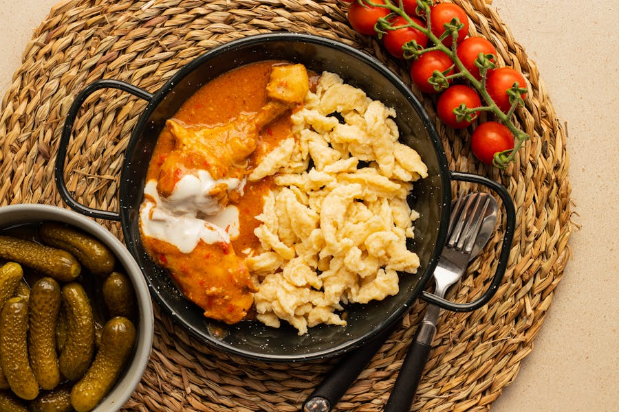
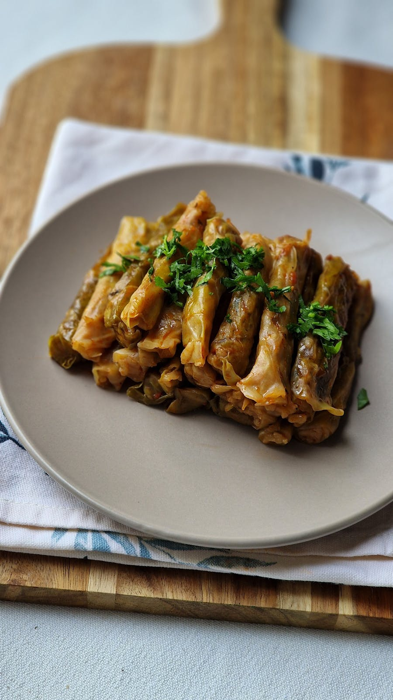
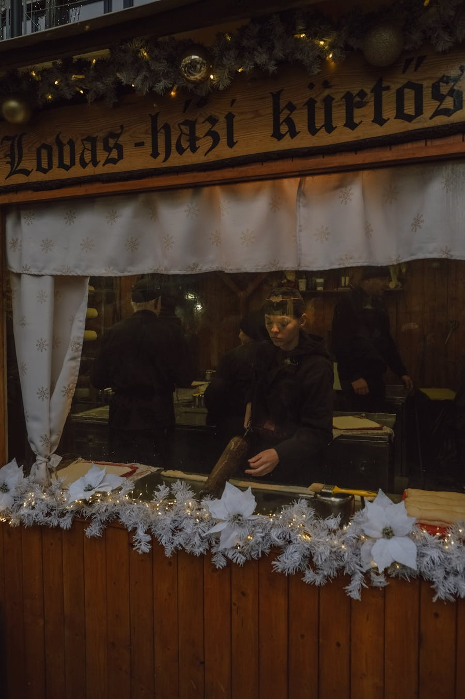
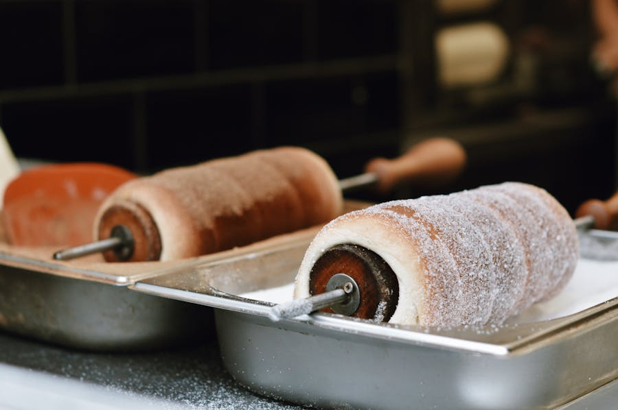
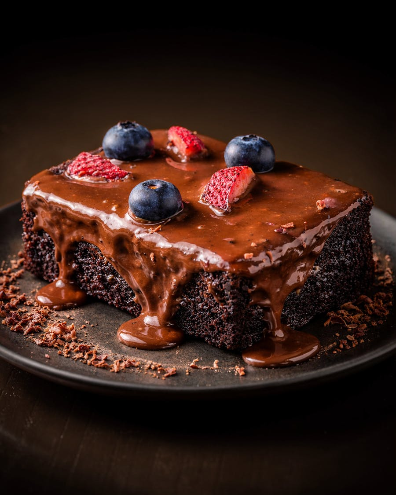
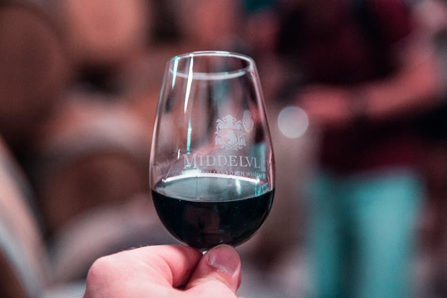
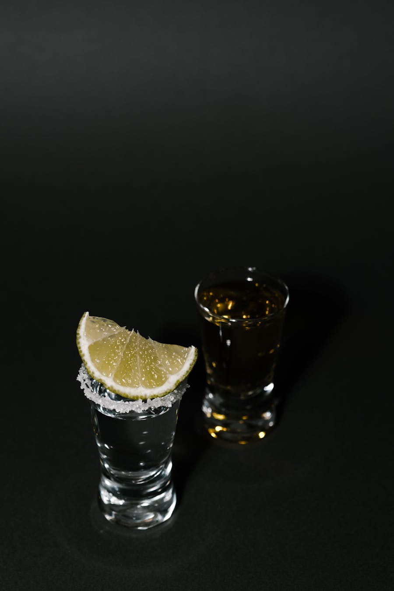
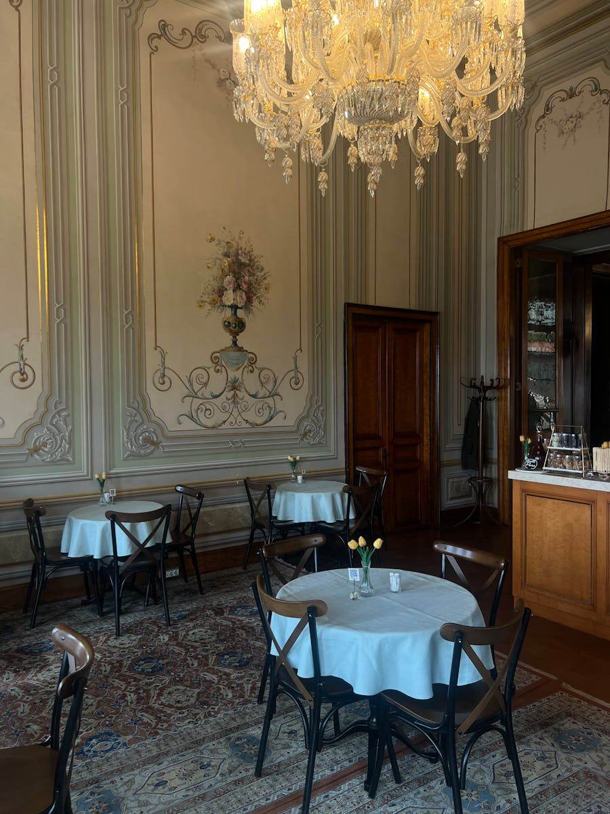
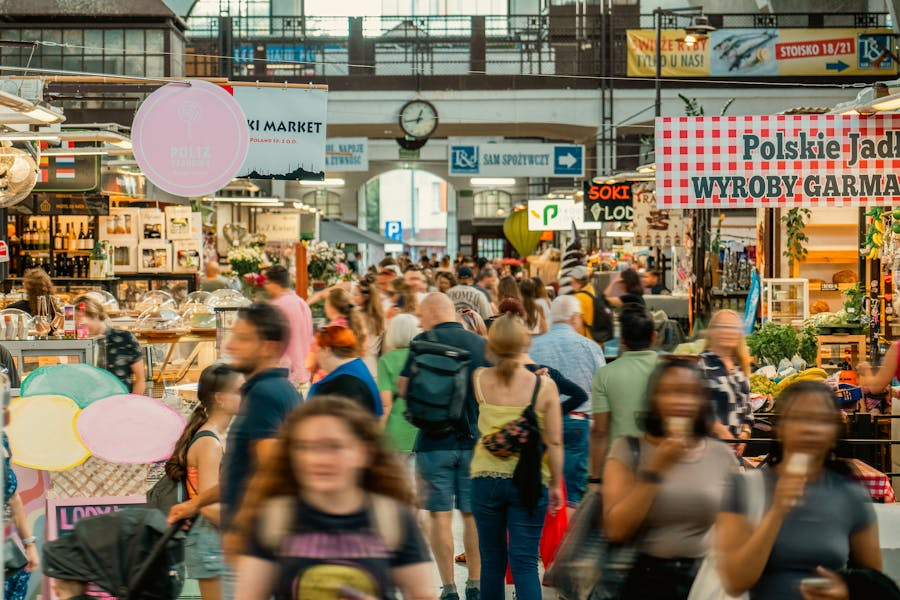

# Hungarian Food Guide — Budapest Edition

A pocket primer to eat your way through Budapest. Hungarian cuisine sits at the crossroads of Central Europe, the Ottoman world, and the steppe — paprika-stained, slow-cooked, and unapologetically rich. Pair it with a glass of Tokaji or a shot of pálinka and you'll understand why Hungarians say *"the way to a Magyar's heart is through the stomach."*

This guide pairs with the [3-day Budapest itinerary](Budapest_3_Day_Itinerary.md). Each dish below tells you **what it is, where to try it, and what to pay**.

---

## The Big Picture: 5 Things to Know

1. **Paprika is everything.** Brought from the Americas via Ottoman trade in the 16th century, it became Hungary's national spice. Use it to start half the country's national dishes.
2. **The main meal is lunch.** Hungarians eat a full hot meal at midday. Look for the **napi menü** (daily set lunch) — usually soup + main + drink for 2,500–4,500 HUF on weekdays.
3. **Soup is a course, not an appetizer.** Real Hungarian gulyás is a hearty soup, *not* a stew. The thick paprika stew you may have eaten back home is **pörkölt** here.
4. **Bread is sacred.** Slices of crusty white bread (*kenyér*) accompany nearly every meal. Mopping up sauce is encouraged.
5. **Wine over beer.** Hungary has six wine regions and 22 indigenous grape varieties. Even cheap house wine is usually good. Beer is fine but rarely the local star.

---

## Soups — Levesek

### Goulash (Gulyásleves)

The dish foreigners think they know but mostly don't. Real **gulyás** is a clear-broth **soup** with chunks of beef, potato, carrot, onion, paprika, and tiny pinched dumplings called *csipetke*. Cooked traditionally outdoors in a *bográcsos* kettle over an open fire — the herder's stew that became national identity.

- **Where:** **Hungarikum Bisztró** (Steindl Imre u. 13), **Frici Papa** (Király u. 55, no-frills canteen), or **Fakanál** upstairs in Great Market Hall.
- **Price:** 2,200–4,500 HUF.
- **Order tip:** Ask if it comes with *csipetke* — the dumplings are a sign of the real thing.

### Halászlé — Fisherman's Soup

A blood-red, intensely paprika'd soup of carp, catfish, or pike from the Danube and Tisza. Traditionally served with white bread and a glass of dry Furmint wine. Hot, smoky, and eye-wateringly red.

- **Where:** **Halászbástya Étterem** (Castle Hill, with view), **Horgásztanya Vendéglő** (Fő u. 27, traditional Buda fish house).
- **Price:** 3,500–6,000 HUF.
- **Watch for:** Bones! Eat slowly.

### Jókai Bableves — Smoked Bean Soup

Heavy, smoky kidney-bean soup with smoked pork knuckle and *csipetke*. Named after 19th-century novelist Mór Jókai. A meal in itself — perfect for a cool spring evening.

- **Where:** **Bagolyvár** (Owl Castle, City Park), **Két Szerecsen** (Nagymező u. 14).

---

## Main Dishes — Főételek

### Chicken Paprikash (Paprikás Csirke)

The dish that should be Hungary's culinary ambassador. Bone-in chicken stewed with onions, paprika, and finished with sour cream, served over **nokedli** (egg dumplings, like spätzle). Velvety, deep-orange, and comforting.

- **Where:** **Frici Papa**, **Két Szerecsen**, **Központi Kávéház**. Also at most coffee houses for lunch.
- **Price:** 3,500–6,500 HUF.
- **Order tip:** Always served with **galuska** or **nokedli** dumplings — never rice.

### Pörkölt — The "Real Goulash" Stew

Thick paprika stew with beef, pork, or veal — closer to what most foreigners imagine when they hear "goulash." Cooked low and slow, no flour thickener, just patience. Served with nokedli or potatoes.

- **Where:** **Stand 25 Bistro** (Hold u. 13, Michelin Bib Gourmand version), **Bagolyvár** (City Park).
- **Price:** 4,500–8,500 HUF.

### Töltött Káposzta — Stuffed Cabbage

Sour-cabbage rolls filled with seasoned pork, rice, and paprika, simmered in a tomato-paprika sauce, often layered with sauerkraut and smoked sausage. Eat with a heavy hand of sour cream on top.

- **Where:** **Frici Papa** (the budget classic), **Hungarikum Bisztró**, **Bagolyvár**.
- **Price:** 3,000–5,500 HUF.
- **Note:** This is comfort food at its peak — particularly good after a thermal bath in cool weather.

### Lecsó — Paprika & Tomato Stew

A summer-into-autumn favorite: yellow peppers, ripe tomatoes, onions, and paprika cooked into a sweet-smoky stew. Sometimes with smoked sausage or a poached egg cracked into the pan. Vegetarian-friendly in its simplest form.

- **Where:** Most traditional bisztrós; especially good at **Két Szerecsen** and **Klassz** (Andrássy út 41).

### Hortobágyi Palacsinta — Savory Crepe

Thin pancakes wrapped around a meat-paprika filling, baked in sour-cream sauce. The savory cousin of the more famous sweet palacsinta — a clever appetizer.

- **Where:** **Gundel** (the source of the original 1930s recipe), **Hungarikum Bisztró**.

### Mangalica — Hungary's Famous Wooly Pig

The fluffy, marbled, fat-rich heritage breed of pig endemic to Hungary, often called the "Kobe beef of pork." Look for **Mangalica chops, salami, and lard** at fine-dining spots and the Great Market Hall.

- **Where:** **Pesti Disznó** (Nagymező u. 19), **Belvárosi Disznótoros** (Király u. 1-3).

---

## Street Food — Utcai Ételek

### Lángos

The unofficial national snack. Fried disc of yeast dough — pizza-sized — slathered with sour cream and cheese, sometimes garlic oil, sometimes ham, sometimes Nutella. Crispy outside, fluffy inside, oil-glistening, dangerously filling.

- **Where:** Upstairs counters at **Great Market Hall** (Lángos Sarok), **Retró Lángos Büfé** (Bajcsy-Zsilinszky út, near Astoria), **Karaván** food court (Kazinczy u. 18). Open-air markets often have one too.
- **Price:** 1,800–3,500 HUF for the standard sour-cream-and-cheese.
- **Pro tip:** Order without sour cream + cheese for a lighter "ház" version, or "kolbászos" with sausage and onion.

### Kürtőskalács — Chimney Cake

Originally Transylvanian, now everywhere. Yeasted dough wound around a wooden cylinder, brushed with sugar and butter, then rotated over charcoal until caramelized into a crackly tube. Rolled in cinnamon, walnut, vanilla, or coconut.

- **Where:** **Molnár's Kürtőskalács** (Váci u. 31, the OG with multiple Pest locations), Christmas markets, **Karaván** food court.
- **Price:** 1,500–2,500 HUF.
- **Hot tip:** Eat it warm. Cold chimney cake is sad chimney cake.

### Kolbász — Hungarian Sausage

**Csabai** (smoked, paprika-rich, from Békéscsaba) and **gyulai** (longer, milder, smoked) are the two stars. Grilled at Christmas markets, sliced in delis, eaten with fresh bread and mustard.

- **Where:** **Belvárosi Disznótoros** (pick a sausage from the counter, they grill it), market hall basements.
- **Price:** 2,500–4,000 HUF for a hot sausage plate.

### Sült Gesztenye — Roasted Chestnuts

Old men in fingerless gloves, paper cones, charcoal braziers — this is autumn-into-spring street food on every corner of central Pest. 1,000 HUF for a paper cone.

---

## Desserts — Édességek

### Dobos Torta

Five thin sponge layers, chocolate buttercream between, topped with a sheet of caramelized sugar that you crack open. Invented by József Dobos in 1885 as a cake that wouldn't spoil quickly in pre-refrigeration Europe.

- **Where:** **Gerbeaud** (the historic version), **New York Café**, **Centrál Kávéház**.
- **Price:** 2,500–4,500 HUF a slice.

### Esterházy Torta

Layers of walnut-almond meringue with brandy-spiked buttercream, topped with a feathered white-and-brown chocolate fondant pattern. Named after the noble Esterházy family, supposedly invented in their court bakery.

- **Where:** **Gerbeaud** (the namesake), **Művész Kávéház**, **Auguszt** (Kossuth Lajos u. 14-16, family-run since 1870).

### Somlói Galuska

A messy chocolate, walnut, and rum trifle with whipped cream. Looks chaotic, tastes like a Hungarian Christmas. Created for the 1958 Brussels World's Fair.

- **Where:** **Gundel** (where it was invented), **Centrál Kávéház**.

### Rétes — Hungarian Strudel

Paper-thin pulled-dough strudel, more delicate than the German/Austrian version. Classic fillings: **túrós** (sweet curd cheese with raisins), **almás** (apple-cinnamon), **mákos** (poppy seed), **meggyes** (sour cherry), **káposztás** (savory cabbage).

- **Where:** **First Strudel House of Pest** (Október 6 u. 22), **Rétesvár** (Balta köz 4, in the Castle district).
- **Price:** 800–1,500 HUF a slice.

### Túró Rudi

Hungary's iconic chilled snack: a chocolate-coated bar filled with sweet curd cheese (*túró*). Look for the white-and-red polka-dot wrapper at any grocery store. 300–500 HUF; bring a few home.

---

## Drinks — Italok

### Tokaji — The Wine of Kings

Louis XIV called it *"vinum regum, rex vinorum"* — the wine of kings, the king of wines. The most famous style is **Tokaji Aszú**, a sweet dessert wine made from botrytized grapes, ranked by **puttonyos** (3 to 6, sweeter as it climbs). Dry **Furmint** and **Hárslevelű** are now the rising stars — bright, mineral, and excellent with halászlé.

- **Where to taste:** **Tasting Table** (Bródy Sándor u. 9-11), **Doblo Wine Bar** (Dob u. 20), **Faust Wine Cellar** (under the Hilton on Castle Hill, in 750-year-old vaults).
- **Where to buy:** Great Market Hall ground-floor shops, **Bortársaság** wine shops (chain), or **In Vino Veritas** (Garibaldi u. 5).
- **Price:** From 4,500 HUF for a 0.5L Aszú up to 30,000 HUF for top puttonyos.

### Egri Bikavér — "Bull's Blood of Eger"

A bold red blend from the Eger region. Legend says Turkish besiegers in 1552 thought the defenders were drinking bull's blood for strength. Now made primarily from Kékfrankos with Cabernet Franc, Merlot, Syrah blends.

- **Where:** Any wine bar, restaurant, supermarket.
- **Pairing:** Goulash, paprikás, mangalica, anything bold and red-fleshed.

### Pálinka

Hungarian fruit brandy — 40–50% ABV, distilled from plum (*szilva*), apricot (*barack*), pear (*körte*), or cherry. Served chilled in a tulip glass. Considered medicinal, and offered as a welcome drink at any traditional household. **Drink it slow** — locals will not respect a shot-and-burn approach.

- **Where:** **Magyar Pálinka Háza** (Rákóczi út 17, hundreds of bottles, free tastings), **Pálinka & Wine** at Westend mall, every traditional restaurant.
- **Price:** 1,500–3,500 HUF for a 4 cl pour at a bar.
- **Beware:** Hand-distilled "házi" (homemade) pálinka offered by friendly strangers can be 60%+. Treat with respect.

### Unicum

A bitter herbal liqueur from 40+ herbs, aged in oak. The bottle is a black sphere with a red cross. Made by the Zwack family since 1790. Bracingly medicinal at first sip; addictive by the third. Treat as digestif.

- **Where:** **Zwack Heritage Visitor Centre** (Dandár u. 1) for a tour and tasting; otherwise any bar.
- **Variants:** Try **Unicum Szilva** (plum-aged, smoother) or **Unicum Riserva** (oak-finished, more sophisticated).

### Beer

Hungarian beer is solid if not exceptional. Big domestic brands: **Soproni**, **Borsodi**, **Dreher**. The craft-beer scene has flourished — try **Mad Scientist**, **Monyo**, **Hopfanatic** at **Élesztő** (Tűzoltó u. 22) or **Léhűtő** (Holló u. 12-14).

### Coffee

Budapest's coffee house culture is UNESCO-listed. Order:

- **Presszó kávé** — Italian-style espresso, single shot
- **Hosszú kávé** — long coffee, espresso pulled over more water (ask for "dupla" if you want a double)
- **Tejeskávé** — coffee with steamed milk
- **Kapucsiner** — local cappuccino

The grand cafés to try are listed in the itinerary: **New York Café**, **Centrál Kávéház**, **Gerbeaud**, **Művész Kávéház**, **Ruszwurm**, **Auguszt**, and the secret seventh: **Lukács Cukrászda** (Andrássy út 70).

---

## Where to Find It

### Markets & Food Halls

- **Nagy Vásárcsarnok (Great Market Hall)** — Vámház krt. 1-3. The grandest indoor market: paprika, salami, lángos upstairs.
- **Hold utca Vásárcsarnok** — Hold u. 13. Smaller, less touristy, attached to several modern bistros (Stand 25, Buja Disznók).
- **Hunyadi téri Vásárcsarnok** — Hunyadi tér. Local shopping market, no tourists.
- **Lehel téri Vásárcsarnok** — quirky boat-shaped 1990s building, ground-zero for produce.

### Modern Hungarian Bistros (Reservations Recommended)

| Restaurant | Address | Vibe | Price (mains) |
|---|---|---|---|
| **Stand 25 Bistro** | Hold u. 13 | Michelin Bib Gourmand | 5,500–9,500 HUF |
| **Hungarikum Bisztró** | Steindl Imre u. 13 | Traditional Hungarian, English-friendly | 3,800–6,500 HUF |
| **Két Szerecsen** | Nagymező u. 14 | Bistro classics, terrace | 4,200–7,500 HUF |
| **Klassz** | Andrássy út 41 | No reservations, bar seating, wine focus | 4,500–7,000 HUF |
| **Bagolyvár** | Állatkerti krt. 2 | Women-led "Owl Castle" by Gundel | 4,800–7,000 HUF |
| **Pesti Disznó** | Nagymező u. 19 | Mangalica-focused | 4,500–8,500 HUF |
| **Borkonyha** | Sas u. 3 | 1-Michelin-star wine restaurant | Tasting menu 32,000 HUF |
| **Onyx** | Vörösmarty tér 7-8 | 2-Michelin-star fine dining | Tasting menu 65,000+ HUF |

### Old-School & Budget

- **Frici Papa** (Király u. 55) — cash only, mains 2,500 HUF, locals ordering goulash and stuffed cabbage. Closes at 22:00.
- **Belvárosi Disznótoros** (Király u. 1-3) — pick-your-cut counter; weigh, eat at standing tables.
- **Karaván Street Food** (Kazinczy u. 18) — open-air food court next to Szimpla; lángos, gyros, falafel, beer until 02:00.
- **Bors GasztroBár** (Kazinczy u. 10) — tiny soup + creative baguette stop, 1,500–2,200 HUF.

### Coffee Houses (Historic)

| Café | Address | Founded | What to order |
|---|---|---|---|
| **New York Café** | Erzsébet krt. 9-11 | 1894 | Dobos torta, the gallery view |
| **Centrál Kávéház** | Károlyi u. 9 | 1887 | Veal goulash, marble tables |
| **Gerbeaud** | Vörösmarty tér 7-8 | 1858 | Esterházy torta, terrace |
| **Művész Kávéház** | Andrássy út 29 | 1898 | Apple strudel, opera-day crowds |
| **Ruszwurm** | Szentháromság u. 7 | 1827 | Cremes pastry, Castle Hill |
| **Auguszt** | Kossuth L. u. 14-16 | 1870 | Rétes, family bakery feel |
| **Lukács Cukrászda** | Andrássy út 70 | 1912 | Esterházy torta |

### Ruin Bars (with Food)

- **Szimpla Kert** — the OG, daily 12:00–04:00. Sunday-morning farmers' market 9:00–14:00.
- **Mazel Tov** (Akácfa u. 47) — Israeli/Mediterranean menu in a stunning courtyard bar.
- **Instant-Fogas** — dance club + food court combo, late-night only.
- **Csendes** (Ferenczy I. u. 5) — quiet ruin bar with full kitchen, near the National Museum.

---

## Daily Eating Plan (Spring Edition)

A sample 3-day food map that pairs with the itinerary:

| Day | Breakfast | Lunch | Snack | Dinner |
|---|---|---|---|---|
| 1 | Hotel + a strudel from First Strudel House | Lángos at Great Market Hall | New York Café cake set | Hungarikum Bisztró goulash + Tokaji |
| 2 | Coffee + cremes at Ruszwurm | Café Pierrot or Vár Bistro on Castle Hill | Karaván street food after the bath | Mazel Tov or Klassz |
| 3 | Hotel + buy túró rudi at a corner shop | Centrál Kávéház veal goulash | Kürtőskalács in City Park | Stand 25 Bistro tasting + pálinka digestif |

---

## Survival Phrases

- *Egészségedre!* — Cheers! (literally "to your health")
- *Köszönöm* — Thank you
- *Egy gulyásleves, kérem* — One goulash soup, please
- *A számlát, kérem* — The bill, please
- *Nem kérek (gluténmentes / vegetáriánus)* — I don't want (gluten / vegetarian)
- *Tud a séf valamit ajánlani?* — Can the chef recommend something?

---

## Souvenirs to Take Home

- **Paprika** — buy sealed tins from the Great Market Hall (sweet "édes" or hot "csípős"). Both 1,500–3,000 HUF.
- **Tokaji Aszú** — a 0.5L bottle of 5-puttonyos travels well; pack in your checked bag.
- **Pálinka miniatures** — the airport sells nice gift sets, but **Magyar Pálinka Háza** has more variety at lower prices.
- **Túró Rudi** — buy a 6-pack from Spar at the airport; refrigerate on arrival.
- **Salami** — vacuum-packed **téliszalámi** (winter salami) keeps for months unrefrigerated. **Pick** and **Herz** are the two main brands.
- **Smoked Mangalica lard with paprika** — sounds odd, tastes incredible on bread. Customs-permitting.

Egészségedre! — and may your trousers still fit when you fly home. 🇭🇺
