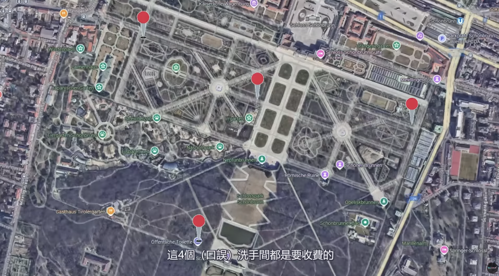
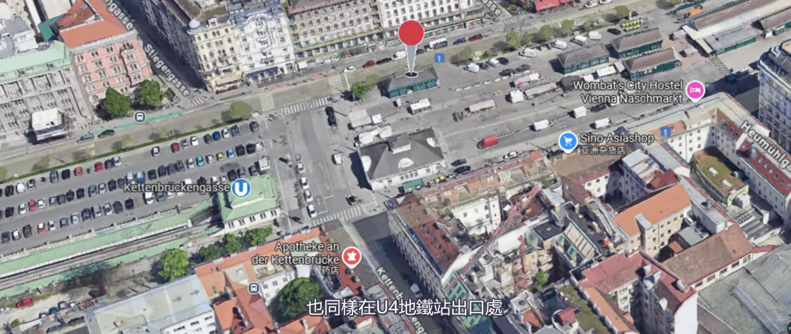

1. *Free* -  [BILLA Corso Hoher Markt](https://maps.app.goo.gl/nqdqYngdBsMvGtof6)
2. Hofburg
    * free : [珍寶館(mperial Treasury)](https://maps.app.goo.gl/nQH7syihqwigzZ5NA)
    * [0.6 euro](https://maps.app.goo.gl/zDnSo3n9NKtASDYL9)
3. 美泉宮
    * [宮殿入口（免費）](https://maps.app.goo.gl/wZjs7o9K9nkSZe396)
    * [停車場內（收費)](https://maps.app.goo.gl/eP4z8r3eS4ZcLiSB9)
    * [售票大廳（收費)](https://maps.app.goo.gl/RzcJPyNFv3PWGT2CA)
    * [後花園1 (收費)](https://maps.app.goo.gl/MLH8XmQxumNcRCa7A)
    * [後花園2（收費）](https://maps.app.goo.gl/m9otxfq94oYZejDS6)
    * [後花園3（收費）](https://maps.app.goo.gl/zfGJ7AnQjkKTqJ9L6)
    * [後花園4（收費）](https://maps.app.goo.gl/evg5oVoi63mHpmNdA)   
4. Naschmarkt 納許市場: 在U4地鐵站出口處    