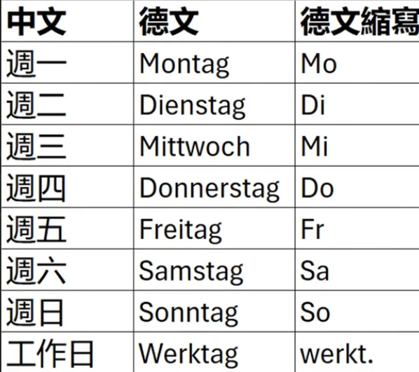
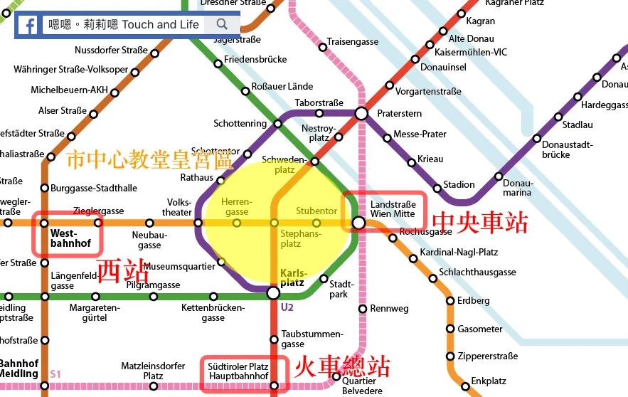
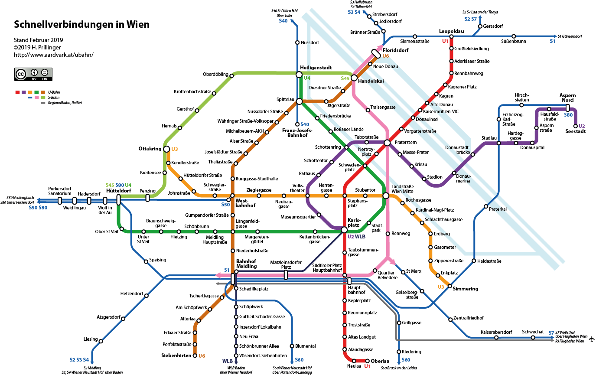
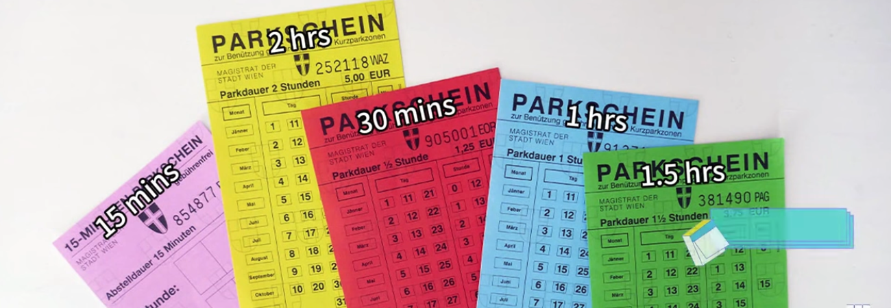
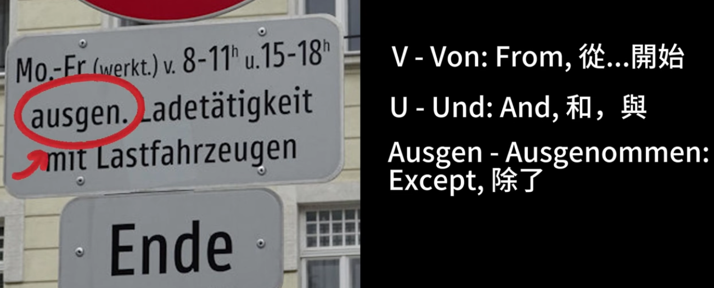
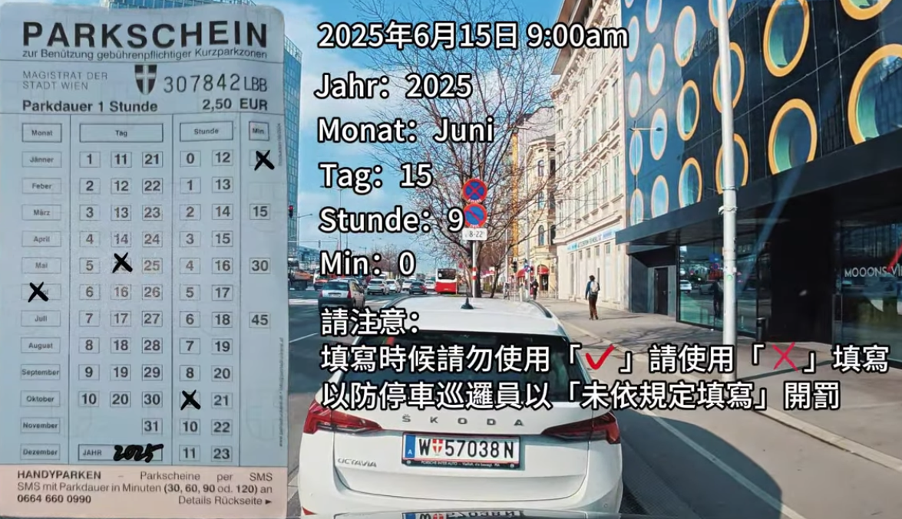
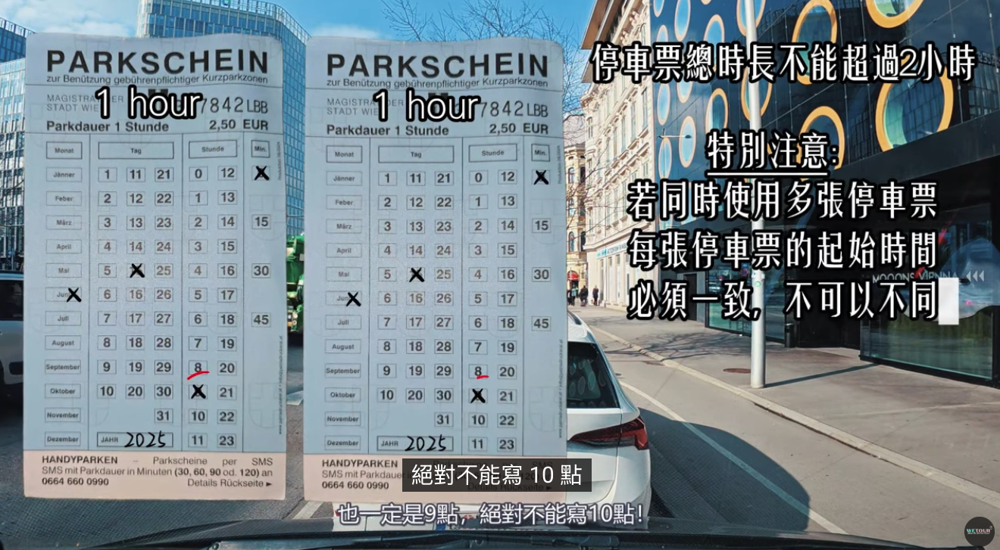

  
 
 
[airport - arte hotel](https://maps.app.goo.gl/r5GN8QFMuztepC9G8)
* [維也納停車 - video](https://youtu.be/UmdhnuNLvr8?si=ING_6Pbju7aeGRcN)
  * [Parking fees in Vienna](https://www.wien.gv.at/en/transportation/parking-fees#prepaid-parking-voucher)
  * [Where to buy parking vouchers](https://www.wien.gv.at/en/transportation/parking-voucher-where-to-buy)
  * [City map - Parking ticket sold here](https://www.wien.gv.at/stadtplan/en/grafik.aspx?bookmark=ITtxRROr-a0Wh-aD1GIQD-aRe5RpllV53Ommkeu25v6MZj6Cg-b-b&lang=en&bmadr=)
  * 最方便，也是最快可以買到停車票: 菸草店, google search: TABAK TRAFIK
  * 15分鐘免費停車票可免費向菸草店店員索取無需支付任何費用   
  
  * [How to fill in prepaid parking vouchers](https://www.wien.gv.at/en/transportation/parking-voucher-how-to-fill-in) 
   
  * 最長時限是兩小時
* [Easypark](https://youtu.be/5naBTyNqaU8?si=jQsJdxw-75EmqWZQ)