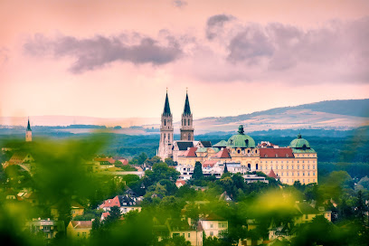
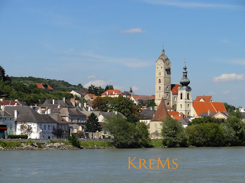
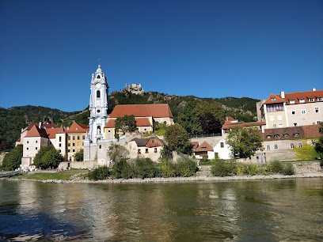
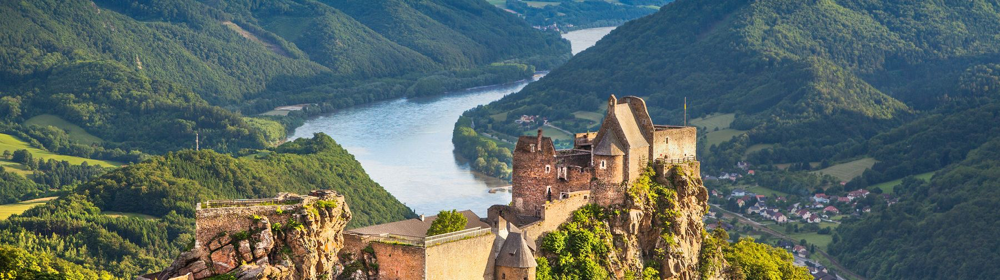
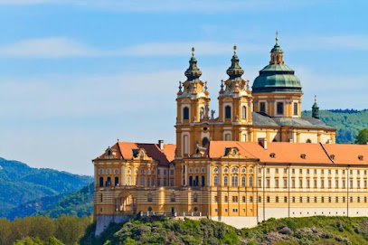
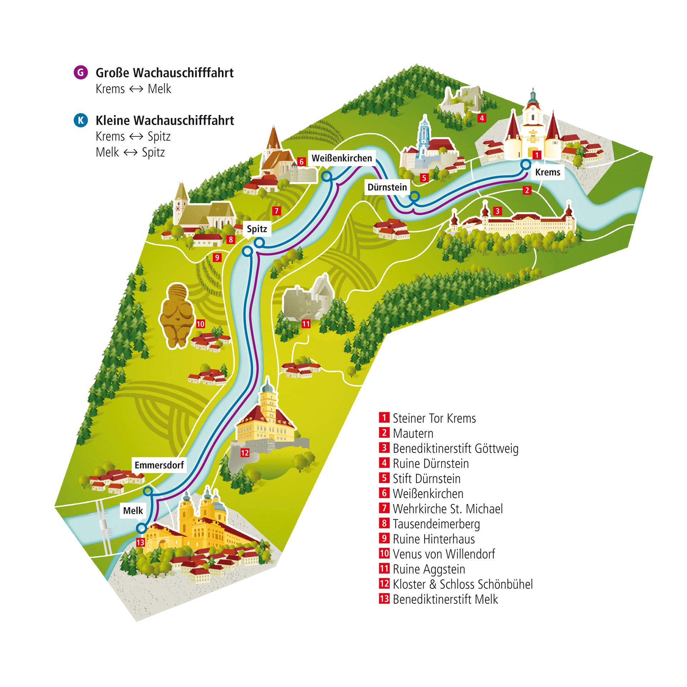

* [Klosterneuburg Monastery](https://maps.app.goo.gl/XJwZVXgxMEjiUqZLA) 克洛斯特新堡修道院 Stift Klosterneuburg 
  * 奧地利最古老酒莊釀酒廠
  * 擁有極高藝術成就的凡爾登祭壇(Verduner Altar) 
  
* [Krems an der Donau](https://maps.app.goo.gl/w6TLe6k2KxnnQTMR9)
  * 豐富農特產品都聚集在這個熱鬧的小鎮 
  
* [Dürnstein](https://maps.app.goo.gl/Q28iZHuPEwVFC7uC6):瓦豪河谷北岸最美小鎮 杜倫斯坦 
* [Aggstein Castle](https://www.ruineaggstein.at)  -  [360-degree-tour](https://www.ruineaggstein.at/en/castle-ruin/360-degree-tour)  

 
[Melk Abbey](https://maps.app.goo.gl/MdGyjUNj6iDL9jHL8): 最著名的百年梅克爾修道院 

* 酒莊  
[Weingut Hermenegild Man](https://www.weingut-hermenegild-mang.at)  
[Rehrl-Fischer](https://www.rehrl-fischer.at)

 

* [DDSG 觀光遊船 TIMETABLE](https://ddsg-blue-danube.at/cruises-wachau/?lang=en)  

* [瓦豪河谷(Wachau/Danube)多瑙河一日遊OBB超值優惠方案](https://www.backpackers.com.tw/forum/showthread.php?t=10622250)
OBB網站上有一個特別的方案相當超值
其中包括了  
1. 維也納(Wien Westbahnhof )-梅克(Melk)或維也納(Wien Franz-Josefs-Bahnhof)-克雷姆斯(Krems) 當天來回各一趟的火車票，時段任選
2. 梅克(Melk)-克雷姆斯(Krems)間由DDSG營運遊船單程的船票
3. Melk Abbey梅克修道院門票

這個方案可以從OBB的APP中直接購買  
1. 先在手機下載OBB
2. 找尋All Products
3. 找到OBB Combination Tickets
4. 點進去後找到Wachau-Tickets
5. 最後看到方案直接購買就好
